# Finishing Touches — .NET Branch Quality Pass

## Overview

Perform a thorough review-and-fix cycle on the current branch's changes before committing and pushing. This skill assumes the **implementation is already done** and focuses on polish: documentation, test coverage, build warnings, static analysis, and CI compliance.

**Core principles:**

- **Fix, don't suppress** — suppressions are a last resort, never a shortcut. When suppression is genuinely needed, use `/dotnet-dev-practical` for the correct technique.
- **Verify every fix** — rebuild after every change. Never assume a fix worked.
- **Zero warnings before push** — every warning pushed costs a full CI round-trip (5-15 minutes). Fix locally in seconds.
- **Evidence before claims** — never report completion without build output, test counts, and CI status.
- **Backup before modify** — before editing any file, save a `.bak` copy so the user can review exactly what changed. See [Backup Before Modify](#backup-before-modify).
- **One unified TODO list drives the pass** — local warnings, failing CI checks, and PR comments/conversations all live in a single tracked list. The skill is not complete until every item on that list is resolved. See [Master TODO List](#phase-25-build-master-todo-list).
- **CI state is known up front, not after push** — a sub-agent inspects existing CI run status before any local work begins so failing checks are visible and planned from the start. See [Phase 1.5](#phase-15-ci-status-pre-check-sub-agent).
- **Non-trivial fixes require Codex validation** — any change beyond mechanical edits is reviewed by the Codex MCP (`mcp__codex-cli__codex`) **before the commit**, not after. Applies equally to warning fixes, CI-failure fixes, and PR-comment-driven fixes. See [Codex Validation Gate](#codex-validation-gate).
- **Zero unaddressed PR comments** — every unresolved review thread must be triaged and closed out before the skill reports complete. Valid issues are fixed in code; false positives get a reply that cites specific evidence (what the code actually does, which test/spec proves it, why the analyser or reviewer was wrong). A thread is never left silent, and a bot-flagged thread is never closed without a reply. See [Phase 11](#phase-11-address-pr-comments-skip-if---no-push).
- **All-green completion gate — non-negotiable.** The hard gate for this skill is defined in **`../../../.claude/rules/pr-checks-completion-gate.md`** (workspace-level). The skill reports complete only when **all four** gate conditions are simultaneously true on the latest pushed commit:
  1. Every CI check (build, tests, Analyze, Codacy, SonarCloud / SonarQube, CodeQL, CodeRabbit, Bito, coverage bots, repository-specific checks) shows `pass` — no `fail`, `pending`, `queued`, `in_progress`, `action_required`, or `skipped`. Required vs not-required is irrelevant.
  2. Every static-analysis bot has rendered a verdict and that verdict is "no new issues". A bot that has not yet posted its check is **not** the same as a passing bot — wait for it (use `ScheduleWakeup` ~270s).
  3. Every PR review thread is either resolved or has us as the latest contributor with an active reply. Bot-authored threads (CodeRabbit, Codacy comments, Bito) follow the same rules as human-authored.
  4. Re-polling produces no new threads, comments, or check runs.

  **Stale checks are still failures.** "Codacy is stale, expected to go green" is **not** an acceptable completion claim. Wait for the rescan or push a follow-up to retrigger.

**Announce at start:** "I'm using the dotnet-dev-finishing-touches skill to perform a quality pass on the current branch."

## Invocation

```
/dotnet-dev-finishing-touches                # Full pass including push + CI gate
/dotnet-dev-finishing-touches --no-push      # Local only — skip push, CI, and PR comments
```

## Runtime Requirements

Before running any phase, check these prerequisites. If one is missing, **stop and tell the user** — do not silently work around the gap.

| Requirement | Required for | Fallback if missing |
|-------------|-------------|---------------------|
| `dotnet` CLI (.NET 9+ SDK) | Phases 4, 5, 7 | Stop — the skill cannot run without it. |
| `gh` CLI, authenticated (`gh auth status`) | Phases 1, 1.5, 10, 11 | Stop if Phase 10/11 is in scope. For Phase 1/1.5 the skill can continue without PR context but must flag the gap in the report. |
| `git` CLI, working tree clean of unrelated changes | All phases | Stop and ask the user to commit/stash unrelated work. |
| `Agent` tool (for Phase 1.5 sub-agent) | Phase 1.5 only | Skip Phase 1.5 and run the CI pre-check inline from the main context; record the skip in the report. |
| `TaskCreate` / `TaskUpdate` / `TaskList` tools | Phase 2.5 master TODO list | Fall back to `mcp__contextstream__memory(action="create_todo")` if ContextStream is active, otherwise an in-memory list tracked in the main transcript. Never proceed without *some* tracked list. |
| `mcp__codex-cli__codex` | Codex Validation Gate | Retry once via `ToolSearch`; if still missing, **pause and ask the user** whether to proceed without the gate (and record the decision in the final report). Never silently skip. |
| `superpowers:verification-before-completion` skill | Phase 12 | If unavailable, invoke the verification checklist inline (re-run build, re-run tests, re-check CI, re-enumerate PR threads) — do not skip the verification itself. |

## The Process

```dot
digraph finishing_touches {
    rankdir=TB;
    node [shape=box, style="rounded"];

    detect [label="0. Detect Repository\n& Solution"];
    context [label="1. Understand Branch Context\n(PR, issue, all changes)"];
    diff [label="2. Identify Modified Files\n(committed + uncommitted + unstaged)"];
    nuget_check [shape=diamond, label="NuGet-producing\nproject?"];
    docs [label="3. XML Documentation Pass\n(every public member)"];
    coverage [label="4. Test Coverage Analysis"];
    coverage_ok [shape=diamond, label="Coverage\n>= 80%?"];
    add_tests [label="4b. Add Missing Tests"];
    coverage_infra [shape=diamond, label="Needs significant\nnew test infra?"];
    ask_tests [label="STOP: Ask user\nabout test infrastructure"];
    build [label="5. Build Solution\n(dotnet build)"];
    warnings [shape=diamond, label="Warnings on\nmodified files?"];
    classify [label="6. Classify Each Warning\n(/dotnet-dev-practical)"];
    valid [label="6a. Valid: Fix code"];
    api_impact [shape=diamond, label="Fix affects\npublic API?"];
    ask_api [label="STOP: Ask user\nabout API change"];
    semantic [shape=diamond, label="Fix changes\nsemantic behaviour?"];
    ask_semantic [label="STOP: Ask user\nabout behaviour change"];
    false_pos [label="6b. False positive:\nSuppress inline\n(/dotnet-dev-practical)"];
    global_check [shape=diamond, label="Same warning in\n3+ other files?"];
    global_suppress [label="6c. Disable globally\nin .editorconfig"];
    verify [label="7. Rebuild & Verify\n(warning gone?)"];
    fix_ok [shape=diamond, label="Warning\nresolved?"];
    more_warnings [shape=diamond, label="More warnings\nremaining?"];
    grand_review [label="8. Grand Review\n(all changes, suggestions)"];
    review_ok [shape=diamond, label="Changes\nready?"];
    apply [label="8b. Apply Suggestions"];
    commit [label="9. Commit\n(/commit skill)"];
    push_check [shape=diamond, label="--no-push?"];
    push [label="10. Push & CI Gate"];
    ci_ok [shape=diamond, label="All CI checks\ngreen?"];
    fix_ci [label="Read logs, fix,\nloop to step 5"];
    comments [label="11. Address PR Comments"];
    comments_ok [shape=diamond, label="All addressed?\nNo new ones?"];
    report [label="12. Report Completion"];
    skip_push [label="Skip push\nReport locally"];

    detect -> context -> diff -> nuget_check;
    nuget_check -> docs [label="yes"];
    nuget_check -> coverage [label="no"];
    docs -> coverage;
    coverage -> coverage_ok;
    coverage_ok -> build [label="yes"];
    coverage_ok -> coverage_infra [label="no"];
    coverage_infra -> ask_tests [label="yes"];
    coverage_infra -> add_tests [label="no"];
    ask_tests -> add_tests;
    add_tests -> build;
    build -> warnings;
    warnings -> grand_review [label="no"];
    warnings -> classify [label="yes"];
    classify -> valid;
    classify -> false_pos;
    classify -> global_check;
    valid -> api_impact;
    api_impact -> ask_api [label="yes"];
    api_impact -> semantic [label="no"];
    ask_api -> semantic;
    semantic -> ask_semantic [label="yes"];
    semantic -> verify [label="no"];
    ask_semantic -> verify;
    false_pos -> verify;
    global_check -> global_suppress [label="yes"];
    global_check -> false_pos [label="no"];
    global_suppress -> verify;
    verify -> fix_ok;
    fix_ok -> more_warnings [label="yes"];
    fix_ok -> classify [label="no — retry fix"];
    more_warnings -> classify [label="yes"];
    more_warnings -> grand_review [label="no"];
    grand_review -> review_ok;
    review_ok -> commit [label="yes"];
    review_ok -> apply [label="no"];
    apply -> build;
    commit -> push_check;
    push_check -> push [label="no"];
    push_check -> skip_push [label="yes"];
    push -> ci_ok;
    ci_ok -> comments [label="yes"];
    ci_ok -> fix_ci [label="no"];
    fix_ci -> build;
    comments -> comments_ok;
    comments_ok -> report [label="yes"];
    comments_ok -> diff [label="no — new changes needed"];
}
```



---

### Backup Before Modify

Before the skill edits **any** file (XML docs, warning fixes, suppression additions, documentation updates, test additions, etc.), it **must** create a backup copy of the original file with a `.bak` extension appended to the full filename.

**Mechanism:**

```bash
cp "path/to/MyClass.cs" "path/to/MyClass.cs.bak"
```

**Rules:**

- Create the `.bak` copy **before the first edit** to that file. If a file is edited multiple times during the pass, only one `.bak` is needed (the original state before any finishing-touches changes).
- If a `.bak` file already exists for that path (e.g. from a previous run), **overwrite it** — it represents a stale backup.
- **New files** (e.g. new test classes) do not need a `.bak` — there is no original to back up.
- `.bak` files must **never** be staged, committed, or pushed. See Phase 9.
- Track all created `.bak` files in a list for the completion report in Phase 12.

**Cleanup:** The `.bak` files are left in place for the user to review. The user is responsible for deleting them when satisfied. The skill should **not** delete `.bak` files automatically.

---

### Phase 0: Detect Repository & Solution

1. **Find the repo root:**
   ```bash
   REPO_ROOT=$(git rev-parse --show-toplevel)
   REPO_NAME=$(basename "$REPO_ROOT")
   ```

2. **Locate the solution file.** Prefer `.slnx` over `.sln`. Prefer the file matching the repo name pattern (e.g. `Ploch.Common.slnx` in `ploch-common`):
   ```bash
   find "$REPO_ROOT" -maxdepth 2 -name "*.slnx" -not -path "*/.history/*" -not -path "*/samples/*" | sort
   find "$REPO_ROOT" -maxdepth 2 -name "*.sln" -not -path "*/.history/*" -not -path "*/samples/*" | sort
   ```
   If multiple solution files exist and the correct one is ambiguous, present the list and ask the user.

3. **Detect the base branch:**
   ```bash
   BASE_BRANCH=$(git symbolic-ref refs/remotes/origin/HEAD 2>/dev/null | sed 's@^refs/remotes/origin/@@')
   if [ -z "$BASE_BRANCH" ]; then
     BASE_BRANCH=$(git branch -r | grep -oP 'origin/(main|master)' | head -1 | sed 's@origin/@@')
   fi
   ```
   Convention: `ploch-common` uses `master`; newer repos use `main`.

4. Store `REPO_ROOT`, `REPO_NAME`, `SOLUTION_FILE`, and `BASE_BRANCH` for all subsequent phases.

---

### Phase 1: Understand Branch Context

Gather full context about the branch's purpose.

1. **Check for an associated PR:**
   ```bash
   gh pr view --json number,url,title,body,labels,state 2>/dev/null || echo "NO_PR"
   ```

2. **If a PR exists**, extract linked issue numbers from the PR body (look for `Closes #N`, `Refs #N`, `Fixes #N`, `Resolves #N`).

3. **If a linked issue is found:**
   ```bash
   gh issue view <number> --json number,title,body,labels,comments
   ```
   Understand the issue requirements, acceptance criteria, and any discussion context.

4. **Understand the branch purpose** from all gathered context — PR description, issue body, branch name, commit messages. This context drives decisions in later phases (e.g. whether a warning fix would change the branch's intended behaviour).

5. **Store the issue number** for the commit `Refs` footer in Phase 9.

---

### Phase 1.5: CI Status Pre-Check (Sub-Agent)

**Purpose:** Before any local work begins, inventory the current CI state of the branch so failing checks are visible from the start and feed directly into the master TODO list in Phase 2.5. This runs even when the branch has **not** been pushed yet (in which case the sub-agent simply reports "no runs yet" and the main skill continues).

**Scope:** Read-only inspection. The sub-agent does not fix anything — it only gathers.

**Invocation:** Use the `Agent` tool with `subagent_type="general-purpose"` and brief it to:

1. Detect whether a PR exists for the current branch and whether any CI runs have started:
   ```bash
   gh pr view --json number,url,statusCheckRollup 2>/dev/null
   gh run list --branch "$(git branch --show-current)" --limit 20 --json databaseId,name,status,conclusion,workflowName,headBranch,event,createdAt
   ```
2. For every check with `conclusion` other than `success`/`skipped`/`neutral` (i.e. `failure`, `cancelled`, `timed_out`, `action_required`, or still `in_progress`), fetch the failure logs:
   ```bash
   gh pr checks <pr-number> --json name,state,link,description
   gh run view <run-id> --log-failed
   ```
3. For each non-green check, extract and return a structured entry:
   - Check name (e.g. `build-test-sonar / build`, `SonarCloud Code Analysis`)
   - Status / conclusion
   - Run ID and link
   - Root-cause excerpt (3–15 lines of the actual failing output — not the whole log)
   - Suggested TODO title (e.g. `Fix SonarCloud quality gate failure: duplicated blocks in Foo.cs`)
4. Report back as a bullet list grouped by workflow. Under 300 words. **No fixes. No file edits.**

**Brief template to pass to the sub-agent:**

> Inspect the CI state of the current branch (`<branch-name>`) on `<repo-name>`. Do not modify any files. For every CI check that is not green (failed, cancelled, timed out, action required, or still in progress), retrieve the failure log excerpt and return a structured list I can fold into a master TODO. For each non-green check, include: check name, status, run ID + link, a 3–15 line excerpt of the actual failure, and a suggested TODO title. If the branch has not been pushed or has no CI runs yet, say so explicitly. Under 300 words.

**Merge into the skill state:** Capture the sub-agent's output under a `CI_ISSUES` list. It becomes one of the inputs to Phase 2.5. If the sub-agent reports no PR / no runs, record `CI_ISSUES = []` and proceed.

---

### Phase 2: Identify Modified Files

Build the complete picture of all changes on the branch.

1. **All committed changes vs base branch:**
   ```bash
   git diff "$BASE_BRANCH"...HEAD --name-only
   ```

2. **Uncommitted changes (staged + unstaged):**
   ```bash
   git diff --name-only          # unstaged
   git diff --staged --name-only # staged
   ```

3. **Untracked files:**
   ```bash
   git ls-files --others --exclude-standard
   ```

4. **Merge** all lists into a deduplicated set of modified files. Filter to `.cs` files for code analysis phases.

5. **Read the full diffs** for context:
   ```bash
   git diff "$BASE_BRANCH"...HEAD  # committed changes
   git diff                         # unstaged
   git diff --staged                # staged
   ```

---

### Phase 2.5: Build Master TODO List

**Purpose:** Consolidate every known actionable item into a single tracked list so nothing slips and the completion gate has an unambiguous "all done" condition.

**When:** After Phase 1.5 (CI pre-check) and Phase 2 (modified files) — before any fixes are applied. The list is expanded again whenever a later phase surfaces new items (additional warnings after a rebuild, new PR comments after a push).

**Mechanism:** Use the `TaskCreate` tool (or ContextStream `memory(create_todo)` if ContextStream is active) so the items are visible to the user and survive sub-agent dispatch. One TODO per actionable item.

**Required TODO sources — all three must be harvested, not just local issues:**

1. **Local build warnings** — from Phase 5. Initially seeded as a single placeholder TODO ("Run initial build and enumerate warnings on modified files"); once the build runs, the placeholder is expanded into one TODO per warning-on-modified-file.
2. **Failing CI checks** — from the Phase 1.5 sub-agent's `CI_ISSUES` list. One TODO per non-green check, with the check name, run link, and root-cause excerpt referenced in the TODO body.
3. **PR review threads, conversations, and reviews** — fetched here (not just in Phase 11). REST endpoints do not expose thread resolution state, so the primary source is the GraphQL `reviewThreads` connection:
   ```bash
   # Thread IDs + resolution state (primary source for TODO creation)
   gh api graphql -f query='
   query($owner:String!,$repo:String!,$pr:Int!){
     repository(owner:$owner,name:$repo){
       pullRequest(number:$pr){
         reviewThreads(first:100){
           nodes{
             id isResolved isOutdated
             comments(first:20){
               nodes{ databaseId author{login} body path line diffHunk url }
             }
           }
         }
       }
     }
   }' -F owner=<owner> -F repo=<repo> -F pr=<pr-number>

   # Issue-level conversation comments (PR discussion, not inline review)
   gh api repos/<owner>/<repo>/issues/<pr-number>/comments --paginate
   # Full review objects (for body-only reviews without inline comments)
   gh api repos/<owner>/<repo>/pulls/<pr-number>/reviews --paginate
   ```
   **One TODO per unresolved, non-outdated review thread + one TODO per issue-comment that raises an actionable concern.** Resolved or outdated threads are excluded. Automated-bot threads (SonarCloud, Codacy, Dependabot, codeant-ai) are included — they must be triaged and replied-to the same as human reviewer threads. Record each thread's GraphQL `id` (e.g. `PRRT_...`) and the root comment's `databaseId` in the TODO body so Phase 11 can reply + resolve without re-fetching.

**Additional sources folded in as the pass progresses:**

- XML doc gaps identified in Phase 3 — **one TODO per file** (not per member) to keep the list manageable.
- Coverage gaps identified in Phase 4 — one TODO per file under 80%.
- Grand-review findings from Phase 8 — one TODO per actionable suggestion.
- New items surfaced by Codex validation in the [Codex Validation Gate](#codex-validation-gate) — one TODO per Codex finding rated "must fix" or "should fix".

**TODO item format:**

| Field | Content |
|-------|---------|
| Title | Short imperative (e.g. "Fix SA1600 missing XML docs in `Foo.cs`") |
| Source | One of: `local-warning`, `ci-check`, `pr-comment`, `xml-docs`, `coverage`, `grand-review`, `codex` |
| Reference | File + line / check name + run link / comment URL |
| Trivial? | `yes` or `no` — drives the Codex Validation Gate decision |
| Status | `pending` → `in_progress` → `completed` |

**Rules:**

- The TODO list is the **source of truth** for whether the skill is done. The completion gate in Phase 12 reads it.
- Do **not** collapse multiple issues into one TODO to hide scope.
- Do **not** mark a TODO complete on intent — mark it complete only after the fix is verified (rebuild clean / check re-ran green / comment replied-to or conversation resolved).
- A TODO from a CI check is **not** complete until the same check is green on a subsequent run.
- A TODO from a PR comment is **not** complete until either: the conversation is resolved on GitHub, or a reply has been posted explaining the disagreement with evidence.
- If a later phase surfaces new items, add them to the list immediately — never defer to the report.

---

### Phase 3: XML Documentation Pass (conditional)

**Condition:** This phase runs only for NuGet-producing projects. Detect by checking if the project(s) containing modified files set `GeneratePackageOnBuild=true` or do not set `IsPackable=false`.

Quick heuristic: source projects (under `src/`) are packable by default in this workspace. Test projects (ending with `Tests`) are not.

For each modified `.cs` file in a NuGet-producing project:

1. **Read the file** and identify all `public` members — classes, interfaces, structs, enums, records, methods, properties, constructors.

2. **For each public member without XML docs**, add documentation following `rules/documentation.md`:
   - `<summary>` on all public types, methods, properties, constructors.
   - `<param>` for each parameter.
   - `<returns>` for non-void methods.
   - `<exception>` for thrown exceptions.
   - `<example>` when usage is not obvious or multiple valid patterns exist.
   - Use British English.
   - Follow Microsoft's style (reference `System.Text.Json`, `Microsoft.Extensions.DependencyInjection` for examples).

3. **For each public member with existing XML docs**, review for correctness:
   - All parameters documented and named correctly (no stale `<param>` tags for renamed/removed parameters).
   - Return value described accurately.
   - Summary matches current behaviour (not stale from a refactor).
   - Exception documentation matches actual throws.

4. Optionally use the Roslyn MCP tool for public API surface discovery:
   ```
   mcp__plugin_dotnet-claude-kit_cwm-roslyn-navigator__get_public_api
   ```

**Cross-reference:** `rules/documentation.md`, `dotnet-skills:csharp-api-design`.

---

### Phase 4: Test Coverage Analysis

1. **Run tests with coverage:**
   ```bash
   dotnet test "$SOLUTION_FILE" /p:CollectCoverage=true /p:CoverletOutput=./CoverageResults/ "/p:CoverletOutputFormat=cobertura%2copencover"
   ```

2. **Analyse coverage** on the modified files. The target is **>= 80%** on changed/new code.

3. Optionally use the Roslyn MCP tool for coverage mapping:
   ```
   mcp__plugin_dotnet-claude-kit_cwm-roslyn-navigator__get_test_coverage_map
   ```

4. **If coverage is below 80%:**
   - **Assess scope:** Can the missing tests be added without significant new test infrastructure (new test harnesses, database fixtures, complex mock setups)?
   - **If yes:** Add the missing tests following `rules/writing-dotnet-tests.md` — xUnit v3, FluentAssertions, AutoFixture. Test both positive and negative cases. Name tests: `<TestedMethodName>_should_<what_it_should_do>`.
   - **If no (significant new infra needed):** **STOP and ask the user** whether to proceed with test infrastructure creation or defer.

**Cross-reference:** `dotnet-claude-kit:testing`, `rules/writing-dotnet-tests.md`.

---

### Phase 5: Build Solution

1. **Build with normal verbosity** to capture all warnings:
   ```bash
   dotnet build "$SOLUTION_FILE" -v normal 2>&1
   ```

2. **Read the entire build output.** Do not skim.

3. **Extract all warnings**, categorising by source analyser (SA, RCS, S, CA, CC, VSTHRD, CS, IDE, EF, NU). Use the prefix reference from `/dotnet-dev-practical` → `analyzer-reference.md`.

4. **Filter to warnings that originate from modified files** (the file set from Phase 2).

5. **If zero warnings on modified files**, proceed directly to Phase 8 (Grand Review).

---

### Phase 6: Classify & Address Each Warning

This is the centrepiece phase. **Use `/dotnet-dev-practical` as the primary reference** for all suppression technique details — do not reinvent the wheel.

For each warning on a modified file, follow this decision tree:

#### Is the warning valid?

**YES — the code should be fixed:**

1. Plan the fix carefully. Before applying, check two safety gates:

   **Safety Gate 1 — Public API impact:**
   Does the fix rename, remove, or change the signature of a public member? Does it add `sealed`, change a return type, or alter an interface?
   - If **yes**: **STOP and ask the user.** Public API changes are a permanent commitment in a NuGet library.
   - If **no**: proceed to Safety Gate 2.

   **Safety Gate 2 — Semantic behaviour change:**
   Does the fix change the runtime behaviour of the code on this branch? (e.g. altering exception handling, changing data transformation logic, modifying control flow)
   - If **yes**: **STOP and ask the user.** The finishing-touches pass should not alter the branch's intended behaviour without explicit approval.
   - If **no**: apply the fix.

2. After applying the fix, proceed to Phase 7 (Rebuild & Verify).

**NO — the warning is a false positive:**

1. Check: does the **same warning appear in 3 or more other files** across the solution?
   ```bash
   dotnet build "$SOLUTION_FILE" -v normal 2>&1 | grep "<WARNING_ID>" | wc -l
   ```

2. **If common (3+ files):** Disable globally in `.editorconfig` rather than suppressing inline:
   ```ini
   dotnet_diagnostic.<ID>.severity = none  # <reason>
   ```
   For test-specific suppressions, use the nested `.editorconfig` in `tests/`.

3. **If isolated (< 3 files):** Suppress inline using the narrowest scope technique from `/dotnet-dev-practical`:
   - **Single line:** `#pragma warning disable <ID>` with `#pragma warning restore <ID>` and a comment explaining why.
   - **Single member:** `[SuppressMessage("Category", "ID", Justification = "...")]` — the `Justification` is **mandatory**.
   - The suppression **must** include a documented reason. Never suppress without explaining why.

4. Proceed to Phase 7 (Rebuild & Verify).

#### Rules that must NEVER be suppressed

Consult `/dotnet-dev-practical` → `analyzer-reference.md` → "Rules That Should Never Be Suppressed":
- VSTHRD002, VSTHRD100, VSTHRD110 (threading bugs)
- CS8600-CS8777 (nullable violations — elevated to ERROR in workspace)
- CA2100 (SQL injection), CA2153 (corrupted state exceptions)
- S2068 (hard-coded credentials), S3329 (weak crypto)

If one of these fires on a modified file, it indicates a real bug. Fix the code.

**Cross-reference:** **`/dotnet-dev-practical`** — primary reference for this phase. Read its SKILL.md for the full decision guide, `[SuppressMessage]` category values per analyser, `.editorconfig` severity values, and `<NoWarn>` patterns.

---

### Phase 7: Rebuild & Verify

After each fix or suppression in Phase 6:

1. **Rebuild the solution:**
   ```bash
   dotnet build "$SOLUTION_FILE" -v normal 2>&1
   ```

2. **Verify** the specific warning is resolved.

3. **Check for new warnings** introduced by the fix. If any appeared, they become new entries for Phase 6.

4. **If the warning persists** despite the fix, re-evaluate the approach. Try an alternative fix or a different suppression technique.

5. **Loop** until zero warnings remain on modified files, then proceed to Phase 8.

---

### Phase 8: Grand Review

Review all changes made during the finishing-touches pass holistically.

1. **Read the full diff:**
   ```bash
   git diff          # unstaged finishing-touches changes
   git diff --staged # if anything was staged
   git diff "$BASE_BRANCH"...HEAD  # full branch diff including prior commits
   ```

2. **Check for:**
   - Consistency with the branch's original purpose — do all changes still make sense together?
   - Naming consistency (British English, camelCase, verb-first methods per `rules/naming.md`).
   - Unused imports or dead code introduced by fixes.
   - PII in test data (use anonymised/fake data per `rules/code-quality.md`).
   - No leftover debugging code, TODO comments, or temporary workarounds.

3. **Project documentation review — keep markdown docs in sync with code changes.**

   The branch's changes may have introduced new features, changed behaviour, added configuration options, or modified APIs that are described in the project's manually-authored markdown documentation. These docs **must** be updated to reflect the current state.

   **Discovery — find all project documentation:**
   ```bash
   # Primary location
   find "$REPO_ROOT/docs" -name "*.md" 2>/dev/null
   # Root-level docs
   ls "$REPO_ROOT"/README.md "$REPO_ROOT"/RELEASE_NOTES.md "$REPO_ROOT"/CHANGELOG.md 2>/dev/null
   # Other common locations
   find "$REPO_ROOT" -maxdepth 2 -name "*.md" -not -path "*/.git/*" -not -path "*/node_modules/*" -not -path "*/bin/*" -not -path "*/obj/*" -not -path "*/.claude/*" -not -path "*/change-log/*" 2>/dev/null
   ```

   **For each documentation file found**, check whether the branch's changes affect what it describes:
   - **README.md** — Does it describe features, APIs, or usage patterns that have changed? Are installation instructions, quick-start examples, or configuration options still accurate?
   - **docs/*.md** — Do design documents, architecture guides, or spec files reference behaviour or APIs that the branch modified? Are code examples still valid?
   - **RELEASE_NOTES.md / CHANGELOG.md** — Should a new entry be added for user-visible changes (new features, breaking changes, significant bug fixes)?
   - **Any other `.md` files** in the project — plans, migration guides, API references.

   **What to do:**
   - If a doc page describes something the branch changed → **update the doc** to match the new reality.
   - If a doc page contains code examples that reference modified APIs → **update or verify the examples**.
   - If a doc page describes a feature that was removed → **remove or update the section**.
   - If the branch adds a significant new feature not covered by any existing doc → **note it in the completion report** as a suggestion (creating new documentation pages is outside finishing-touches scope unless the user requests it).
   - **Do not create new documentation files** unless explicitly asked — this skill focuses on keeping existing docs accurate.

4. Optionally use Roslyn MCP tools for deeper analysis:
   ```
   mcp__plugin_dotnet-claude-kit_cwm-roslyn-navigator__detect_antipatterns
   mcp__plugin_dotnet-claude-kit_cwm-roslyn-navigator__find_dead_code
   ```

4. **If suggestions are actionable and non-controversial**, apply them and loop back to Phase 5 (Build).

5. **If suggestions require user input** or are outside the finishing-touches scope, record them for the completion report.

**Cross-reference:** `dotnet-claude-kit:80-20-review`, `dotnet-claude-kit:code-review-workflow`.

---

### Phase 9: Commit

**Delegate to the `/commit` skill** for the actual commit creation.

Before invoking `/commit`, ensure:

1. **All files are ready.** Stage specific files — **never** `git add -A` or `git add .`. **Exclude all `.bak` files** — they must never be staged or committed. Verify the **staged** index contains no `.bak` paths:
   ```bash
   # Lists only files staged for commit — must be empty
   git diff --cached --name-only | grep -E '\.bak(/|$)' && echo "FAIL: .bak staged" || echo "OK"
   ```
   `git status` alone is **insufficient** because it also lists untracked `.bak` files, which are expected and allowed — the check must scope to the staged index.
2. **The issue number** is known from Phase 1. If none was found, follow the lookup order in `rules/commits.md`: check PR → search issues → ask the user.
3. **Breaking changes** are detected: check for removed/renamed public APIs, changed method signatures, changed defaults, changed serialisation formats.
4. **The commit type** matches the nature of changes (typically `chore` or `refactor` for finishing-touches, but `fix` if a real bug was found and fixed, `docs` if only documentation was added).

**Commit-message ownership.** The `/commit` skill handles generic mechanics (conventional format, HEREDOC, `Co-Authored-By` trailer) but **does not** enforce this workspace's `Refs: #<issue-number>` footer or `BREAKING CHANGE:` footer — those are per-repo rules from `rules/commits.md`. This skill is therefore responsible for:

- Composing the **full** commit message body, including the `Refs: #<issue-number>` footer (always mandatory per `rules/commits.md`) and `BREAKING CHANGE: …` footer (when detected).
- Passing that message to `/commit` or running `git commit -F <message-file>` / HEREDOC directly.

**Post-commit verification.** Immediately after the commit, verify the footers are present:

```bash
# Must match "Refs: #<digits>" (case-insensitive)
git log -1 --format=%B | grep -iE '^Refs:\s*#[0-9]+' >/dev/null || {
  echo "FAIL: latest commit missing 'Refs: #N' footer — amend or recreate"; exit 1;
}

# If a BREAKING CHANGE was detected in Phase 9 pre-check, verify the footer
# (skip this check if no breaking change)
```

If the footer is missing, **do not push**. Create a new commit that includes the full message (never `git commit --amend` unless the user explicitly asks — per `rules/agent.md`), or use `git reset --soft HEAD~1` and re-commit with the correct message.

If the finishing-touches pass made changes across multiple logical areas (e.g. docs + warning fixes + new tests), a single commit is fine — the commit message body should list all categories of changes.

**Cross-reference:** `/commit` skill, `rules/commits.md`.

---

### Phase 10: Push & CI Gate (skip if `--no-push`)

**Authoritative reference:** `.claude/rules/pr-checks-completion-gate.md` (workspace-level). The four-condition gate defined there is the bar this phase must pass. The steps below are the operational mechanics; the rule defines the standard.

**Bots that must reach a `success` verdict before this phase exits** (when present on the PR): `build`, `Test Results`, `Analyze (csharp)` (CodeQL), `Codacy Static Code Analysis`, `SonarCloud Code Analysis` / `SonarQube Cloud`, `CodeRabbit`, `Bito AI Code Review Agent`, any coverage bot (Codecov / Coveralls / Codacy Coverage), and any repository-specific custom check. A bot that has not yet appeared in `gh pr checks` is **not** absent — it is **pending its first run**, and you wait for it.

1. **Pre-push build verification:**
   ```bash
   dotnet build "$SOLUTION_FILE"
   ```
   If any warnings appear, **stop and fix before pushing**.

2. **Push:**
   ```bash
   git push -u origin HEAD
   ```

3. **Monitor ALL CI checks** (including non-required):
   ```bash
   gh pr checks --watch
   ```
   If no PR exists, monitor via:
   ```bash
   gh run list --branch "$(git branch --show-current)" --limit 5
   gh run view <run-id> --log-failed
   ```

4. **On failure:**
   - Retrieve failure logs: `gh run view <run-id> --log-failed`
   - Diagnose the root cause from the actual error output. Do not guess.
   - Fix the issue.
   - Loop back to **Phase 5** (Build) — go through the full fix cycle again.
   - After pushing the fix, monitor checks again. Repeat until all green.

5. **Do not:**
   - Ignore or dismiss failing checks — even non-required ones.
   - Assume a failure is flaky without evidence.
   - Push speculative fixes without reading the failure logs.
   - Disable a rule or suppress an error to make CI pass.

---

### Phase 11: Address PR Comments (skip if `--no-push`)

**Authoritative reference:** `.claude/rules/pr-checks-completion-gate.md` § "Conversations Must Be Addressed". The seven-category triage and the reply-quality bar defined there are the standard. The steps below are the operational mechanics.

After CI passes, process **every** unresolved review thread and issue-level comment on the PR. The bar is **zero unaddressed threads** before Phase 12. A thread without a reply, or closed without a reply, does **not** count as addressed. Bot-authored threads (CodeRabbit, Codacy comment threads, Bito, SonarCloud quality-gate threads) follow the **same** rules as human-authored threads — "it's just a bot" is not a triage category.

#### Step 1 — Re-enumerate threads (definitive list)

Fetch the current state of every review thread (the Phase 2.5 snapshot is stale after commits + CI):

```bash
gh api graphql -f query='
query($owner:String!,$repo:String!,$pr:Int!){
  repository(owner:$owner,name:$repo){
    pullRequest(number:$pr){
      reviewThreads(first:100){
        nodes{
          id isResolved isOutdated
          comments(first:20){
            nodes{ databaseId author{login} body path line url createdAt }
          }
        }
      }
    }
  }
}' -F owner=<owner> -F repo=<repo> -F pr=<pr-number>
```

Keep only threads where `isResolved=false` AND `isOutdated=false`. These are the threads Phase 11 must close out.

Also refresh:

```bash
gh api repos/<owner>/<repo>/issues/<pr-number>/comments --paginate
gh api repos/<owner>/<repo>/pulls/<pr-number>/reviews --paginate
```

#### Step 2 — Triage every thread

Classify each thread into **exactly one** category. Record the category on the thread's TODO:

| Category | Meaning | Required resolution path |
|----------|---------|--------------------------|
| `VALID_ISSUE` | The reviewer/analyser is correct and the code needs to change | Fix code → Codex (if non-trivial) → commit → push → CI green → reply citing commit + evidence → resolve thread |
| `FALSE_POSITIVE` | The flag is wrong — code is correct, analyser misread, reviewer misread the context | Reply with specific evidence (what the code actually does, which test/spec/invariant proves it, why the flag is wrong) → resolve thread |
| `ALREADY_FIXED` | The concern is valid but was resolved in a subsequent commit on this branch | Reply pointing at the specific commit hash + diff line → resolve thread |
| `SUGGESTION_ACCEPTED` | Non-blocking suggestion worth taking | Same flow as `VALID_ISSUE` |
| `SUGGESTION_DECLINED` | Non-blocking suggestion we decline on merit | Reply explaining why (principle, trade-off, out-of-scope + follow-up issue link) → resolve thread |
| `QUESTION` | Reviewer asked for clarification, no code change implied | Reply with the answer → resolve thread |
| `OUT_OF_SCOPE` | Valid concern but outside this PR's scope | Open a follow-up GitHub issue, reply linking the issue → resolve thread. Per `feedback_create_followup_issues` memory — always file the issue, never defer verbally. |

**A thread must never be closed without a reply.** "Resolve with no response" is only acceptable when the thread was authored by us and had no other participants.

#### Step 3 — Reply quality rules (especially for FALSE_POSITIVE)

A false-positive reply is **not** "This is a false positive." A good reply:

1. States the classification up front (e.g. "I believe this is a false positive because…").
2. Cites the actual behaviour of the code — file + line or linked test.
3. Explains why the analyser or reviewer's mental model diverges from the code.
4. Points at verification: a test that covers the case, a spec doc, a runtime invariant, or the language spec itself.
5. If the reply would change the reviewer's mind *only* via trust, it is insufficient — add evidence.

For bot-flagged false positives (SonarCloud, Codacy, codeant-ai): the same bar applies. "The bot is wrong" is never enough on its own.

#### Step 4 — Fix workflow for VALID_ISSUE / SUGGESTION_ACCEPTED threads

For each thread in these categories:

1. Mark the TODO `in_progress`.
2. Create `.bak` copies of all files the fix will touch (per [Backup Before Modify](#backup-before-modify)).
3. Plan the fix. Apply the [Safety Gate 1 — Public API impact](#phase-6-classify--address-each-warning) and [Safety Gate 2 — Semantic behaviour change](#phase-6-classify--address-each-warning) checks from Phase 6.
4. **Codex validation (mandatory before commit for non-trivial fixes)** — invoke the [Codex Validation Gate](#codex-validation-gate) with the thread URL, original code, proposed diff, and reasoning. Do **not** commit until the verdict is `APPROVED` or `APPROVED_WITH_NOTES`.
5. Apply the fix. Rebuild (loop back to Phase 5 → Phase 7 if warnings regress). Run the affected tests.
6. Commit (via the `/commit` skill — one commit per logical thread group; batching threads that touch the same file or concern is fine, but the commit message body must list every thread addressed). **Never amend.**
7. Push. Monitor CI via Phase 10 until all checks are green.
8. Reply on the thread (using the root `databaseId` as `in_reply_to`):
   ```bash
   gh api repos/<owner>/<repo>/pulls/<pr-number>/comments \
     -f body='<evidence-based response referencing commit <hash> and the specific change>' \
     -F in_reply_to=<root-comment-databaseId>
   ```
9. Resolve the thread:
   ```bash
   gh api graphql -f query='mutation($id:ID!){resolveReviewThread(input:{threadId:$id}){thread{id isResolved}}}' \
     -F id=<thread-id>
   ```
10. Mark the TODO `completed` and record the reply URL + commit hash on the TODO for the Phase 12 report.

#### Step 5 — Reply-only workflow for FALSE_POSITIVE / SUGGESTION_DECLINED / ALREADY_FIXED / QUESTION / OUT_OF_SCOPE

For each thread in these categories (no code changes):

1. Mark the TODO `in_progress`.
2. Draft the reply following the [reply quality rules](#step-3--reply-quality-rules-especially-for-false_positive).
3. For `OUT_OF_SCOPE`: open a follow-up issue first, then include the issue URL in the reply (per the project's `feedback_create_followup_issues` memory).
4. For `ALREADY_FIXED`: run `git log -S "<relevant change>" -- <file>` to find the exact commit hash, and link it in the reply.
5. Post the reply (see Step 4.8 for the command).
6. Resolve the thread (see Step 4.9 for the mutation).
7. Mark the TODO `completed` and record the reply URL on the TODO.

**When to leave a thread unresolved:** If the reply is genuinely awaiting reviewer acknowledgement on a subjective judgement call (e.g. architectural disagreement), post the reply but leave `isResolved=false`. In this case the TODO is still `completed` from the skill's side (we did our part), but the Phase 12 report **must** list the thread under "Awaiting reviewer" with the reply URL. Do this sparingly — for bot threads or clear-cut false positives, always resolve.

#### Step 6 — Re-poll and loop

After the last thread is closed out:

1. Re-run the GraphQL enumeration from Step 1.
2. Re-run the issue-comments fetch.
3. If any new threads or comments have appeared (including new reviewer responses to our replies), add them to the master TODO list and loop back to Step 2.
4. Only exit Phase 11 when a full enumeration pass returns zero new or unaddressed threads.

#### Step 7 — Handoff to Phase 12

Pass forward for the completion report:

- Count of threads addressed, broken down by category.
- List of commits that addressed `VALID_ISSUE` / `SUGGESTION_ACCEPTED` threads.
- List of "Awaiting reviewer" threads (should be rare or empty).
- List of follow-up issues opened for `OUT_OF_SCOPE` items.

**Cross-reference:** `review-pr-comments` skill, `address-pr-comments` skill, memory `feedback_pr_comments_must_be_addressed`, memory `feedback_create_followup_issues`.

---

### Phase 12: Report Completion

**REQUIRED:** Use `superpowers:verification-before-completion` before reporting.

**Authoritative gate:** `.claude/rules/pr-checks-completion-gate.md` (workspace-level) — the four conditions defined there are the bar. **Reproduce the verification sequence ("The Pre-Completion Verification") from that rule and confirm every output before writing a completion report.** If any of the four conditions is false on the latest pushed commit, the skill is **not done**: continue the loop, schedule a polling wakeup if waiting on a bot, do not switch to a "completion with caveats" framing.

**Forbidden completion framings** (these were the historical failure modes that motivated this rule):

- ❌ "Done — Codacy is stale, expected to be green on rescan" → **wait for the rescan**
- ❌ "Done — Bito hasn't run yet" → **wait for Bito**
- ❌ "Done — only non-required checks failing" → **non-required checks count**
- ❌ "Done — addressed the most important PR comments" → **all comments must be addressed**
- ❌ "Done with caveat: external bot dependency" → **bots are part of the gate, no caveats**

**Hard completion gate — mode-aware.** Which conditions apply depends on whether Phase 10 / Phase 11 ran (they are skipped under `--no-push`).

**Always required (both modes):**

1. **Build is clean.** `dotnet build "$SOLUTION_FILE"` completes with zero errors and zero warnings on modified files. Re-run immediately before reporting.
2. **All tests pass locally.** The latest `dotnet test` run is green.
3. **Every TODO item from Phase 2.5 is `completed`.** No `pending` or `in_progress` items. A CI-check TODO counts as complete only after the same check re-runs green; a PR-comment TODO counts as complete only after the thread is resolved or replied-to with evidence.
4. **Grand Review (Phase 8) found no outstanding concerns** the user needs to decide on.

**Additionally required when Phase 10 ran (`--no-push` OFF):**

5. **Every CI check is green.** Re-query `gh pr checks` immediately before reporting. If any check is failing, cancelled, timed out, action-required, or still in progress, the skill is **not** done — return to the appropriate earlier phase (Phase 5 for build/test failures, Phase 11 for comment-driven fixes) and loop. Non-required checks count too.

**Additionally required when Phase 11 ran (`--no-push` OFF AND a PR exists):**

6. **Zero unaddressed PR review threads.** Re-run the Phase 11 Step 1 GraphQL enumeration one final time. Every thread in the result must satisfy one of:
   - `isResolved=true`, **or**
   - `isResolved=false` AND the latest comment on the thread is authored by us AND the thread is listed under "Awaiting reviewer" in the final report.

   Any thread that is `isResolved=false` with the latest comment authored by someone other than us is **unaddressed** — loop back to Phase 11 Step 2.
7. **No new PR activity has arrived since the last poll.** Re-fetch issue comments and reviews one final time. If anything new has appeared (new inline comments, new review, new issue comment), extend the TODO list and loop back to Phase 11.

If any applicable condition is not satisfied, **do not report completion.** State which gate failed and continue the loop.

**`--no-push` mode note:** Conditions 5–7 are explicitly **not** checked, because the branch has not been pushed and there are no CI runs or PR threads to evaluate. The completion report in this mode must clearly state "local-only — CI and PR-thread gates not evaluated".

Provide a summary with evidence:

```markdown
## Finishing Touches Complete

### Branch
`<branch-name>` on `<repo-name>`

### Changes Applied
- **XML Documentation:** <count> members documented/updated
- **Test Coverage:** ~<percentage>% on modified code (<count> tests added)
- **Warnings Resolved:** <count> fixed, <count> suppressed (with justification), <count> disabled globally
- **Code Review Fixes:** <count> improvements applied

### Warning Resolution Summary
| Warning ID | File | Resolution | Justification |
|------------|------|------------|---------------|
| SA1600 | Foo.cs | Fixed — added XML docs | — |
| S1075 | Bar.cs | Suppressed inline | Test fixture constant |
| ... | ... | ... | ... |

### Build Status
Zero warnings. All tests passing (<count> total, <count> new).

### CI Status
All checks green: <link or output>

### PR Comments
All <count> review threads addressed.

| Category | Count | Threads |
|----------|-------|---------|
| VALID_ISSUE (fixed in code) | <n> | <list of thread URLs → commit hashes> |
| SUGGESTION_ACCEPTED (fixed in code) | <n> | <list of thread URLs → commit hashes> |
| FALSE_POSITIVE (reply + resolve) | <n> | <list of thread URLs → reply URLs> |
| ALREADY_FIXED (reply + resolve) | <n> | <list of thread URLs → existing commit hashes> |
| SUGGESTION_DECLINED (reply + resolve) | <n> | <list of thread URLs → reply URLs> |
| QUESTION (reply + resolve) | <n> | <list of thread URLs → reply URLs> |
| OUT_OF_SCOPE (reply + follow-up issue + resolve) | <n> | <list of thread URLs → issue URLs> |
| AWAITING_REVIEWER (reply, thread left open) | <n> | <list of thread URLs → reply URLs> |

**Follow-up issues opened:** `<list of issue URLs, or "none">`.

### Suggestions (deferred)
- <suggestion 1>
- <suggestion 2>

### Backed-Up Files
The following files were modified by this pass. `.bak` copies of the originals
are available for diff review. Delete them when satisfied.

| Original File | Backup File |
|---------------|-------------|
| `src/Foo/Bar.cs` | `src/Foo/Bar.cs.bak` |
| `src/Baz/Qux.cs` | `src/Baz/Qux.cs.bak` |
| ... | ... |

**Quick diff command:**
```bash
# Compare all backed-up files against their modified versions
for bak in $(find . -name "*.bak" -not -path "*/bin/*" -not -path "*/obj/*"); do
  echo "=== ${bak%.bak} ==="
  diff "${bak}" "${bak%.bak}" || true
done
```

**Cleanup command:**
```bash
find . -name "*.bak" -not -path "*/bin/*" -not -path "*/obj/*" -delete
```

### Commit
`<commit-hash>` — `<commit-message-subject>`
```

---

## Codex Validation Gate

**Purpose:** Non-trivial fixes (anything beyond a mechanical edit) must pass a second-opinion review by the Codex MCP (`mcp__codex-cli__codex`) **before the change is committed**, not after. This is a cross-cutting gate that applies to Phases 6 (warning fixes), 10 (CI-failure fixes), and 11 (PR-comment fixes), as well as any test additions in Phase 4b.

**Timing rule:** Codex runs on the *uncommitted* diff. The correct sequence is: stage files → invoke Codex on the staged diff → act on the verdict → commit. If you are already mid-commit when you realise the gate was skipped, reset the staging, run Codex, then re-stage and commit as a single commit. Do **not** commit first and retroactively "validate" — that defeats the gate.

**What counts as trivial (no Codex review required):**

- Adding or editing XML `<summary>`, `<param>`, `<returns>`, `<exception>`, `<example>` tags with no code change.
- Adding `[SuppressMessage]` or `#pragma warning disable`/`restore` with documented justification (suppression content, not fix content).
- Renaming an unused local variable to `_`.
- Removing a demonstrably unused `using` directive.
- Formatting-only changes (whitespace, trailing commas, EOL).
- `.editorconfig` severity changes the skill has decided on per existing rules.
- Pure documentation edits to markdown files.

**What counts as non-trivial (Codex review required):**

- Any change to runtime behaviour — control flow, exception handling, data transformation, dispose/lifetime logic.
- Any change to a public API signature (already separately gated by the user-ask rules, but still must pass Codex after the user approves).
- Any change that resolves a CI failure by altering production code (build fix, test fix that changes assertions, Sonar quality-gate fix).
- Any non-trivial test addition or modification (i.e. anything beyond a simple happy-path assertion).
- Any fix applied in response to a PR comment that touches production code.
- Any refactor pulled in from a grand-review suggestion.

**How to invoke Codex:**

Use the `codex` action of `mcp__codex-cli__codex` with a self-contained brief. The brief **must include**:

1. The TODO item being addressed (title + source + reference).
2. The original code (relevant snippet, with file + line range).
3. The proposed fix (diff or full new code).
4. The reasoning for the fix — what was wrong, why this change resolves it, what behaviour changes (if any).
5. A request for a verdict: `APPROVED` / `APPROVED_WITH_NOTES` / `CHANGES_REQUESTED` / `REJECTED`, with concrete issues if anything other than `APPROVED`.

**Brief template for PR-comment-driven fixes (Phase 11):**

> **Context:** Addressing PR review thread `<thread-url>` on `<repo>#<pr>`. Reviewer/analyser (`<login>`) flagged: `<quoted concern>`.
>
> **Classification:** `VALID_ISSUE` / `SUGGESTION_ACCEPTED`.
>
> **Original code** (`<path>:<line-range>`):
> ```<lang>
> <snippet>
> ```
>
> **Proposed fix** (staged diff):
> ```diff
> <diff>
> ```
>
> **Reasoning:** `<what was wrong, why this resolves it, what behaviour changes or stays the same>`.
>
> **Verification:** `<which tests cover this, how I confirmed no regressions — e.g. "tests/Foo.Tests pass locally, no new warnings on rebuild">`.
>
> **Verdict requested:** Please respond `APPROVED` / `APPROVED_WITH_NOTES` / `CHANGES_REQUESTED` / `REJECTED` with specific concerns. Check for: correctness, missed edge cases, public API impact, semantic behaviour drift, better alternative approaches.

**Acting on the Codex verdict:**

| Verdict | Action |
|---------|--------|
| `APPROVED` | Mark the TODO complete after the local verification in Phase 7 passes. |
| `APPROVED_WITH_NOTES` | Apply the recommended refinements, re-verify locally, then mark complete. Record the notes in the final report. |
| `CHANGES_REQUESTED` | Apply the requested changes, re-run the Codex review on the revised fix. Do **not** mark the TODO complete until a subsequent verdict is `APPROVED` or `APPROVED_WITH_NOTES`. |
| `REJECTED` | Discard the fix, pick a different approach, start again from the classification in Phase 6 (or the equivalent phase that raised the item). If Codex repeatedly rejects, stop and ask the user. |

**Batching:** Multiple small fixes touching the same file are reviewed together (single Codex invocation per file is fine). Cross-file refactors or CI-failure fixes that span several files should be reviewed as one cohesive change, not one-file-at-a-time.

**Record the Codex outcome** on the TODO item so the Phase 12 report can list which items went through Codex and how they landed.

**Fallback:** If the Codex MCP is unavailable (tool not loaded, authentication failure, network error), the skill **must not** silently skip the gate. Either:
- Retry once after confirming the tool is available (`ToolSearch` for `mcp__codex-cli__codex`), or
- Pause and ask the user whether to proceed without Codex validation for this pass (and record the decision in the final report).

---

## The Fix Loop

When CI fails or PR comments require code changes:

```
Fix code → Phase 5 (Build — zero warnings locally)
         → Phase 7 (Rebuild & Verify)
         → Phase 8 (Grand Review)
         → Phase 9 (Commit — new commit, not amend)
         → Push (only after local build is clean!)
         → Phase 10 (Monitor CI)
         → Phase 11 (Address Comments)
         → Phase 12 (Report)
```

Each iteration creates a **new commit**. After all fixes are done, update the PR description to reflect the **final** state.

---

## When to Stop and Ask

The skill operates autonomously but **must stop and ask the user** in these situations:

1. **A warning fix affects the public API surface** — renaming a public method, changing a return type, adding `sealed` to a class consumers might inherit, removing a public member.
2. **A warning fix changes the semantic behaviour of the branch's changes** — altering business logic, changing exception handling, modifying data transformation.
3. **Test coverage cannot reach 80% without significant new test infrastructure** — new integration test harnesses, database fixtures, complex mock service setups beyond the scope of a polish pass.
4. **Multiple solution files exist and the correct one is ambiguous** — present the list and ask.
5. **No GitHub issue can be found** for the `Refs` footer — follow the lookup order in `rules/commits.md` and ask if none found.

---

## Autonomous Decision-Making

| Situation | Action |
|-----------|--------|
| Warning you don't understand | Research the analyser rule via `/dotnet-dev-practical` → `analyzer-reference.md`, Microsoft Learn, or web search |
| Unsure if warning is false positive | Check code context, check sibling repos for precedent, check the analyser docs |
| Same suppression needed in 3+ places | Switch to `.editorconfig` global suppression per `/dotnet-dev-practical` |
| Need to add a test but unsure of pattern | Check existing test projects in the repo for patterns; reference `rules/writing-dotnet-tests.md` |
| CI check failure | Read logs (`gh run view --log-failed`), identify root cause, fix |
| PR comment you disagree with | Reply with clear reasoning citing evidence |
| Non-obvious code fix | Consult `dotnet-skills:csharp-coding-standards` for idiomatic patterns |

---

## Red Flags — STOP and Re-evaluate

If you catch yourself about to do any of these, stop and reconsider:

- About to **suppress a warning without documented justification**.
- About to **leave `#pragma disable` without a matching `#pragma restore`**.
- About to **fix a warning in a way that changes public API** without asking.
- About to **fix a warning in a way that changes semantic behaviour** without asking.
- About to **skip the rebuild-and-verify step** after a fix.
- About to **add tests that pass trivially** (not actually exercising the code).
- About to **commit without building and testing** first.
- About to **push with build warnings still present**.
- About to **`git add -A`** instead of staging specific files.
- About to **amend a commit** instead of creating a new one.
- About to **report completion with failing CI checks or unaddressed PR comments**.
- About to **disable a rule globally** when it is only a problem in one file.
- About to **suppress a rule that must never be suppressed** (VSTHRD002/100/110, CS8600-CS8777, CA2100, S2068).
- About to **skip the project documentation review** — markdown docs (README.md, docs/*.md, RELEASE_NOTES.md) must be checked against the branch's changes and updated if they describe modified behaviour, APIs, or features.
- About to **edit a file without creating a `.bak` backup first** — every file modified by the skill must have a backup.
- About to **stage or commit `.bak` files** — they are for user review only, never tracked in git.
- About to **skip the Phase 1.5 CI pre-check sub-agent** — CI state must be known up front, not discovered only after pushing.
- About to **start fixing work without the Phase 2.5 master TODO list being populated** from warnings + CI + PR comments.
- About to **apply a non-trivial fix without a Codex MCP review** — non-trivial fixes must pass the Codex Validation Gate **before the commit**, not after.
- About to **commit a PR-comment-driven code change without running Codex first** — PR-comment fixes are never exempt from the gate; stage, validate, then commit.
- About to **silently skip the Codex gate because the MCP is unavailable** — retry or explicitly ask the user; never pretend the gate passed.
- About to **reply to a PR comment with a generic "false positive" message** — every false-positive reply must cite specific evidence (file/line, test, spec, invariant) per [Step 3 — Reply quality rules](#step-3--reply-quality-rules-especially-for-false_positive).
- About to **resolve a PR review thread without posting a reply first** — a resolved thread without an explicit response does not count as addressed; the only exception is a thread we authored ourselves with no other participants.
- About to **leave a thread unresolved after replying to a bot** (SonarCloud, Codacy, codeant-ai, Dependabot) — bot threads always get both a reply and a resolve.
- About to **defer an out-of-scope PR comment verbally without filing a follow-up issue** — per `feedback_create_followup_issues`, always open the issue and link it in the reply.
- About to **report completion while any CI check is failing or still running**, or while any master-TODO item is not `completed`, or while un-triaged PR comments exist, or while any PR review thread is both `isResolved=false` and has no reply from us since the last reviewer activity.

---

## Quality Gates

| Phase | Gate | Evidence Required |
|-------|------|-------------------|
| 0. Detect | Repo and solution identified | `REPO_ROOT`, `SOLUTION_FILE` set |
| 1. Context | Branch purpose understood | PR/issue details captured |
| 1.5. CI Pre-Check | Sub-agent returned CI state | `CI_ISSUES` list (empty or populated) |
| 2. Modified Files | All changes catalogued | Deduplicated file list |
| 2.5. Master TODO | Unified list built from all sources | TODOs for warnings + CI + PR comments all created |
| 3. XML Docs | Every public member documented (NuGet projects) | No missing docs on modified code |
| 4. Coverage | >= 80% on modified code | Coverage report or estimate |
| 5. Build | Compilation succeeds | Zero errors |
| 6. Warnings | Each warning classified and addressed | Resolution documented per warning |
| 7. Verify | Warning resolved after each fix | Rebuild output confirms |
| 8. Grand Review | All changes reviewed holistically | No outstanding concerns |
| 9. Commit | Conventional format with `Refs` footer | Commit message |
| 10. CI | All checks green (including non-required) | `gh pr checks` output |
| 11. PR Comments | Every thread triaged, fixed-or-replied, and (for bots + clear-cut cases) resolved | Zero `isResolved=false` threads whose latest comment is not ours; category breakdown recorded |
| Codex Gate | Every non-trivial fix reviewed and approved | Codex verdict recorded per TODO |
| TODO Gate | Every master-TODO item `completed` | TODO list snapshot in report |
| 12. Report | Evidence-based completion summary + all-green gate | Summary with counts, links, final `gh pr checks` output |

---

## Integration

**References these rules (auto-loaded from `.claude/rules/`):**
- `agent.md` — Agent behaviour specification and CI check gate
- `commits.md` — Conventional Commit format and issue linking
- `writing-dotnet-tests.md` — xUnit v3, FluentAssertions, AutoFixture standards
- `code-quality.md` — Code quality and error handling standards
- `documentation.md` — XML docs and markdown documentation sync
- `naming.md` — Naming conventions
- `project-structure.md` — Repository and project layout conventions
- `pr-descriptions.md` — PR description standards
- `sample-apps.md` — SampleApp rules for ploch-data

**Uses these skills:**
- **`/dotnet-dev-practical`** — **Primary reference** for warning suppression techniques (Phase 6). Covers `#pragma`, `[SuppressMessage]`, `GlobalSuppressions.cs`, `.editorconfig`, `<NoWarn>`, ReSharper comments, and the full analyser ID reference.
- **`/commit`** — Conventional commit creation (Phase 9)
- **`dotnet-skills:csharp-coding-standards`** — C# code quality and idiomatic patterns
- **`dotnet-skills:csharp-api-design`** — Public API design considerations for libraries
- **`dotnet-claude-kit:testing`** — Testing patterns and strategies
- **`dotnet-claude-kit:code-review-workflow`** — Structured review with Roslyn MCP tools
- **`dotnet-claude-kit:80-20-review`** — Prioritised review focus (Phase 8)
- **`review-pr-comments`** — PR comment analysis and response (Phase 11)
- **`vibe-extras:address-pr-comments`** — triage + fix flow for PR feedback (Phase 11, complementary)
- **`superpowers:verification-before-completion`** — REQUIRED before reporting done

**Uses these MCP tools:**
- `mcp__plugin_dotnet-claude-kit_cwm-roslyn-navigator__get_diagnostics` — Build diagnostics from Roslyn
- `mcp__plugin_dotnet-claude-kit_cwm-roslyn-navigator__get_public_api` — Public API surface for doc review
- `mcp__plugin_dotnet-claude-kit_cwm-roslyn-navigator__get_test_coverage_map` — Coverage analysis
- `mcp__plugin_dotnet-claude-kit_cwm-roslyn-navigator__detect_antipatterns` — Anti-pattern detection
- `mcp__plugin_dotnet-claude-kit_cwm-roslyn-navigator__find_dead_code` — Unused code detection
- **`mcp__codex-cli__codex`** — **Required** second-opinion review for every non-trivial fix (see [Codex Validation Gate](#codex-validation-gate)). Use `ToolSearch` to load the schema if not already available.
- GitHub CLI (`gh`) — PR management, CI monitoring, comment handling

**Uses these tools for sub-agent / TODO orchestration:**
- `Agent` (with `subagent_type="general-purpose"`) — the Phase 1.5 CI pre-check sub-agent.
- `TaskCreate` / `TaskUpdate` / `TaskList` — master TODO list in Phase 2.5 and ongoing throughout the pass.
- `mcp__contextstream__memory(action="create_todo")` — optional alternative to `TaskCreate` when ContextStream is active.
