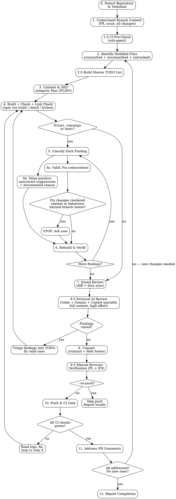

# Finishing Touches — Branch Quality Pass (ploch-ai-site)

## Overview

Perform a thorough review-and-fix cycle on the current branch's changes before committing and pushing. This skill assumes the **implementation is already done** and focuses on polish: content correctness in both languages, SEO surfaces, build health, external AI review, documentation sync, and CI compliance.

This is the web-site adaptation of the workspace's `.NET` finishing-touches skill. The repo is an **Astro static site** (Polish authoritative at `/`, English mirror at `/en/`), built with `npm run build`, type/content-checked with `npm run check` (`astro check`), link-checked in CI with offline lychee, deployed to GoDaddy via FTPS on merge to `main`, with Cloudflare Workers PR previews.

**Core principles:**

- **Fix, don't suppress** — `@ts-expect-error` / `@ts-ignore` and check-silencing config changes are a last resort, never a shortcut, and always carry a comment explaining why.

- **Verify every fix** — rebuild (`npm run build && npm run check`) after every change. Never assume a fix worked.

- **Zero check output before push** — `astro check` must report **0 errors, 0 warnings, 0 hints** on the branch. Every problem pushed costs a full CI round-trip. Fix locally in seconds.

- **Polish is authoritative** — content decisions follow the PL version; EN mirrors it. Any content change on one side must be reflected on the other (see the `sync-content` skill for the file map).

- **Evidence before claims** — never report completion without build output, check output, CI status, and browser-verification evidence.

- **Backup before modify** — before editing any file, save a `.bak` copy so the user can review exactly what changed. See [Backup Before Modify](#backup-before-modify).

- **One unified TODO list drives the pass** — local check output, failing CI checks, PR comments/conversations, and external AI review findings all live in a single tracked list. The skill is not complete until every item on that list is resolved. See [Master TODO List](#phase-25-build-master-todo-list).

- **CI state is known up front, not after push** — a sub-agent inspects existing CI run status before any local work begins. See [Phase 1.5](#phase-15-ci-status-pre-check-sub-agent).

- **Triple external AI review is mandatory** — before commit/push, the **entire PR context** (description, linked issue, full diff, full contents of modified files, repo conventions) is handed to **Codex, Gemini and GitHub Copilot CLI (Grok 4.6)**, which each perform an independent high-effort review of the branch. Three different model families means three different blind spots. Every finding they raise is triaged into the master TODO. See [Phase 8.5](#phase-85-external-ai-review--codex--gemini--copilot-mandatory) and [`rules/external-ai-review.md`](../../rules/external-ai-review.md).

- **Non-trivial fixes require Codex validation** — any change beyond mechanical edits is additionally reviewed by the Codex MCP **before the commit**, not after. Applies equally to check fixes, CI-failure fixes, PR-comment-driven fixes, and external-review-driven fixes. See [Codex Validation Gate](#codex-validation-gate).

- **Zero unaddressed PR comments** — every unresolved review thread must be triaged and closed out before the skill reports complete. Valid issues are fixed in code; false positives get a reply that cites specific evidence. A thread is never left silent, and a bot-flagged thread is never closed without a reply. See [Phase 11](#phase-11-address-pr-comments-skip-if---no-push).

- **All-green completion gate — non-negotiable.** The hard gate is defined in **`.claude/rules/pr-checks-completion-gate.md`** (repo copy; identical workspace-level rule exists). The skill reports complete only when **all four** gate conditions are simultaneously true on the latest pushed commit:

  1. Every CI check (`validate`, `CodeQL` / both `Analyze` jobs, `Sourcery review`, `CodeRabbit`, `Cloudflare Workers Builds`, and any newly-added check) shows `pass` — no `fail`, `pending`, `queued`, `in_progress`, `action_required`, or `skipped`. Required vs not-required is irrelevant.
  2. Every static-analysis / review bot present on the PR has rendered a verdict and that verdict is "no new issues". A bot that has not yet posted its check is **not** the same as a passing bot — wait for it (use `ScheduleWakeup` ~270s). If a SonarCloud or Codacy check ever appears on this repo, the full platform-query requirements from the gate rule apply.
  3. Every PR review thread is either resolved or has us as the latest contributor with an active reply. Bot-authored threads (Copilot, Codex connector, Sourcery, CodeRabbit, codereviewbot) follow the same rules as human-authored.
  4. Re-polling produces no new threads, comments, or check runs.

  **Stale checks are still failures.** "Expected to go green" is **not** an acceptable completion claim. Wait for the rescan or push a follow-up to retrigger.

**Announce at start:** "I'm using the dev-finishing-touches skill to perform a quality pass on the current branch."

## Invocation

```
/dev-finishing-touches                # Full pass including push + CI gate
/dev-finishing-touches --no-push      # Local only — skip push, CI, and PR comments (external AI review still runs)
```

## Runtime Requirements

Before running any phase, check these prerequisites. If one is missing, **stop and tell the user** — do not silently work around the gap.

| Requirement                                        | Required for                    | Fallback if missing                                                                                                                                                                                 |
| -------------------------------------------------- | ------------------------------- | --------------------------------------------------------------------------------------------------------------------------------------------------------------------------------------------------- |
| Node.js 22.12+ / `npm`                             | Phases 4–7, 9.5                 | Stop — the skill cannot run without it.                                                                                                                                                             |
| `gh` CLI, authenticated (`gh auth status`)         | Phases 1, 1.5, 10, 11           | Stop if Phase 10/11 is in scope. For Phase 1/1.5 the skill can continue without PR context but must flag the gap in the report.                                                                     |
| `git` CLI, working tree clean of unrelated changes | All phases                      | Stop and ask the user to commit/stash unrelated work.                                                                                                                                               |
| `Agent` tool (for Phase 1.5 sub-agent)             | Phase 1.5 only                  | Skip Phase 1.5 and run the CI pre-check inline from the main context; record the skip in the report.                                                                                                |
| `TaskCreate` / `TaskUpdate` / `TaskList` tools     | Phase 2.5 master TODO list      | Fall back to `mcp__contextstream__memory(action="create_todo")` if ContextStream is active, otherwise an in-memory list tracked in the main transcript. Never proceed without *some* tracked list.  |
| `mcp__codex-cli__codex` / `mcp__codex-cli__review` | Phase 8.5 + Codex Validation Gate | Load via `ToolSearch` ("select:mcp__codex-cli__codex,mcp__codex-cli__review"); retry once; if still missing, **pause and ask the user** whether to proceed without Codex (record the decision). Never silently skip. |
| `mcp__gemini-cli__gemini` (or `mcp__gemini__gemini-analyze-code`) | Phase 8.5                       | Load via `ToolSearch`; retry once; if still missing, **pause and ask the user** whether to proceed with a reduced panel (record the decision). Never silently skip.                               |
| `copilot` CLI on `PATH`, authenticated (GitHub Copilot CLI) | Phase 8.5                       | Shell-out reviewer — **not** an MCP tool. Run the preflight in [`rules/external-ai-review.md`](../../rules/external-ai-review.md) § Preflight; on failure follow its fallback ladder (retry with token env stripped → Kimi K3 → ask the user). Never silently skip. |
| Browser tooling (`claude-in-chrome` MCP, Playwright MCP, or `curl` fallback) | Phase 9.5 manual verification | Prefer a real browser MCP. If none is available, use `astro preview` + `curl` + dist HTML inspection and state in the report that visual verification was curl-level only.                          |
| `superpowers:verification-before-completion` skill | Phase 12                        | If unavailable, invoke the verification checklist inline (re-run build + check, re-check CI, re-enumerate PR threads) — do not skip the verification itself.                                        |

## The Process



---

### Backup Before Modify

Before the skill edits **any** file (content fixes, check fixes, doc updates, config changes, etc.), it **must** create a backup copy of the original file with a `.bak` extension appended to the full filename.

```bash
cp "src/layouts/Base.astro" "src/layouts/Base.astro.bak"
```

**Rules:**

- Create the `.bak` copy **before the first edit** to that file. One `.bak` per file per pass (the pre-pass state).
- If a `.bak` already exists from a previous run, **overwrite it** — it is stale.
- **New files** do not need a `.bak`.
- `.bak` files must **never** be staged, committed, or pushed. See Phase 9.
- Track all created `.bak` files for the Phase 12 report. Cleanup is the user's call — do not auto-delete.

---

### Phase 0: Detect Repository & Toolchain

1. **Find the repo root and confirm the toolchain:**

   ```bash
   REPO_ROOT=$(git rev-parse --show-toplevel)
   REPO_NAME=$(basename "$REPO_ROOT")
   node --version   # expect >= 22.12
   cat "$REPO_ROOT/package.json"   # confirm scripts: dev/build/preview/check
   ```

2. **Detect the base branch** (this repo uses `main`):

   ```bash
   BASE_BRANCH=$(git symbolic-ref refs/remotes/origin/HEAD 2>/dev/null | sed 's@^refs/remotes/origin/@@')
   [ -z "$BASE_BRANCH" ] && BASE_BRANCH=main
   ```

3. **Know the site map** for later phases: `src/pages/**` (PL at `/`, EN under `en/`), `src/layouts/Base.astro` (shared head/nav/footer/hreflang), `src/i18n/ui.ts` (locale strings), `src/lib/jsonld.ts` (JSON-LD builder), `public/` (verbatim assets incl. `.htaccess`, `_headers`, `robots.txt`, `sitemap-*.xml`), `text-contents/pl|en/` (authoritative markdown content), `docs/` + `adr/` + `ai-tasks/` (not deployed).

4. Store `REPO_ROOT`, `REPO_NAME`, `BASE_BRANCH` for all subsequent phases.

---

### Phase 1: Understand Branch Context

1. **Check for an associated PR:**

   ```bash
   gh pr view --json number,url,title,body,labels,state 2>/dev/null || echo "NO_PR"
   ```

2. **If a PR exists**, extract linked issue numbers from the PR body (`Closes #N`, `Refs #N`, `Fixes #N`, `Resolves #N`).

3. **If a linked issue is found:**

   ```bash
   gh issue view <number> --json number,title,body,labels,comments
   ```

4. **Understand the branch purpose** from PR description, issue body, branch name, and commit messages. For SEO-labelled work, also read the relevant sections of `ai-tasks/seo-positioning-plan.md` / `docs/seo-strategy.md` — content decisions must not contradict the strategy.

5. **Store the issue number** for the commit `Refs` footer in Phase 9.

---

### Phase 1.5: CI Status Pre-Check (Sub-Agent)

**Purpose:** Before any local work begins, inventory the current CI state of the branch so failing checks are visible from the start and feed the master TODO list. Runs even when the branch has not been pushed (the sub-agent then reports "no runs yet").

**Scope:** Read-only. The sub-agent gathers; it does not fix.

**Invocation:** `Agent` tool with `subagent_type="general-purpose"`, briefed to:

1. Detect whether a PR exists and whether CI runs have started:

   ```bash
   gh pr view --json number,url,statusCheckRollup 2>/dev/null
   gh run list --branch "$(git branch --show-current)" --limit 20 --json databaseId,name,status,conclusion,workflowName,event,createdAt
   ```

2. For every check whose `conclusion` is not `success`/`skipped`/`neutral`, fetch failure logs (`gh run view <run-id> --log-failed`; `gh pr checks <pr>`).

3. Return one structured entry per non-green check: check name (e.g. `validate`, `Analyze (javascript-typescript)`, `Workers Builds`), status, run ID + link, a 3–15 line root-cause excerpt, and a suggested TODO title. Under 300 words, no fixes, no file edits.

**Merge into skill state** as `CI_ISSUES` (possibly empty) — an input to Phase 2.5.

---

### Phase 2: Identify Modified Files

1. **All committed changes vs base branch:** `git diff "$BASE_BRANCH"...HEAD --name-only`
2. **Uncommitted:** `git diff --name-only` (unstaged) + `git diff --staged --name-only`
3. **Untracked:** `git ls-files --others --exclude-standard`
4. **Merge** into a deduplicated set. Classify by kind: pages/layouts/components (`.astro`), TypeScript (`.ts`), styles (`.css`), verbatim assets (`public/**`), content sources (`text-contents/**`), docs/config.
5. **Read the full diffs** (`git diff "$BASE_BRANCH"...HEAD`, plus staged/unstaged) — they are the raw material for Phases 3, 7, and 8.5.

---

### Phase 2.5: Build Master TODO List

**Purpose:** Consolidate every known actionable item into a single tracked list so nothing slips and the completion gate has an unambiguous "all done" condition.

**When:** After Phases 1.5 and 2, before any fixes. Expanded whenever a later phase surfaces new items (new check output after a rebuild, external AI review findings, new PR comments after a push).

**Mechanism:** `TaskCreate` (or ContextStream `memory(create_todo)`), one TODO per actionable item, visible to the user.

**Required TODO sources — all four must be harvested:**

1. **Local build/check findings** — from Phase 4. Seed a placeholder TODO ("Run build + check and enumerate findings"), then expand into one TODO per error/warning/hint on modified files (and any pre-existing ones the branch is expected to leave clean — this repo's bar is 0/0/0 repo-wide).

2. **Failing CI checks** — from `CI_ISSUES`. One TODO per non-green check, with check name, run link, and root-cause excerpt.

3. **PR review threads, conversations, and reviews** — fetched here (not only in Phase 11), via GraphQL `reviewThreads` (REST does not expose resolution state):

   ```bash
   gh api graphql -f query='
   query($owner:String!,$repo:String!,$pr:Int!){
     repository(owner:$owner,name:$repo){
       pullRequest(number:$pr){
         reviewThreads(first:100){
           nodes{
             id isResolved isOutdated
             comments(first:20){ nodes{ databaseId author{login} body path line diffHunk url } }
           }
         }
       }
     }
   }' -F owner=<owner> -F repo=<repo> -F pr=<pr-number>

   gh api repos/<owner>/<repo>/issues/<pr-number>/comments --paginate
   gh api repos/<owner>/<repo>/pulls/<pr-number>/reviews --paginate
   ```

   One TODO per unresolved, non-outdated thread + one per actionable issue-level comment. Bot threads (Copilot, Codex connector, Sourcery, CodeRabbit) are included and triaged exactly like human threads. Record each thread's GraphQL `id` and root `databaseId` in the TODO body.

4. **External AI review findings** — from Phase 8.5. One TODO per Codex, Gemini and Copilot finding rated must-fix or should-fix (deduplicate findings more than one reviewer raises; note every attribution on the merged TODO — agreement across independent model families raises confidence and should be recorded).

**Additional sources folded in as the pass progresses:** content-parity gaps from Phase 3 (one TODO per page pair), grand-review findings from Phase 7, Codex Validation Gate findings.

**TODO item format:**

| Field     | Content                                                                                              |
| --------- | ---------------------------------------------------------------------------------------------------- |
| Title     | Short imperative (e.g. "Fix missing EN mirror of new PL services section")                            |
| Source    | One of: `local-check`, `ci-check`, `pr-comment`, `content-parity`, `grand-review`, `codex`, `gemini`, `copilot` |
| Reference | File + line / check name + run link / comment URL / reviewer finding ID                               |
| Trivial?  | `yes` or `no` — drives the Codex Validation Gate decision                                             |
| Status    | `pending` → `in_progress` → `completed`                                                               |

**Rules:**

- The TODO list is the **source of truth** for whether the skill is done. Phase 12 reads it.
- Do not collapse multiple issues into one TODO to hide scope.
- Mark a TODO complete only after the fix is verified (rebuild clean / check re-ran green / thread replied-to and resolved / reviewer finding addressed).
- A CI-check TODO is complete only when the same check is green on a subsequent run.
- New items surfaced later are added immediately — never deferred to the report.

---

### Phase 3: Content & SEO Integrity Pass

This replaces the .NET skill's XML-documentation phase. For every modified page, layout, or content file, verify the site's bilingual and SEO invariants:

1. **PL/EN parity (Polish authoritative):**
   - Every content change on a PL page has its EN counterpart updated (and vice versa — but PL wording wins conflicts).
   - New pages exist in both languages, or the EN gap is an explicit, user-approved decision recorded in the report.
   - `text-contents/pl|en/*.md` sources are kept in sync with the `.astro` pages per the **`sync-content`** skill's file map (markdown is the content source of truth; don't let pages and markdown drift).
   - Shared UI strings live in `src/i18n/ui.ts` with entries for **both** locales — no hardcoded chrome text in pages.

2. **SEO surfaces** on every modified/added page:
   - `title` + `description` present, localised, and passed through `Base.astro` props (not duplicated inline).
   - Canonical URL correct; **hreflang pair reciprocal** (`pl-PL`, `en`, `x-default`) via the layout's `alternatePl`/`alternateEn` props — each page passes its true counterpart URL.
   - Language toggle points at the counterpart page (with `?lang=pl` preserved on PL links — it suppresses the apex auto-redirect).
   - OG/Twitter meta present; OG image URL absolute.
   - JSON-LD (from `src/lib/jsonld.ts`) still parses as valid JSON and its content (names, service lists, URLs) matches any changed page copy — extract from built HTML and `node`-parse it in Phase 4.
   - New/renamed routes are reflected in `public/sitemap-*.xml`, and `robots.txt` / `.htaccess` / `_headers` still make sense (e.g. noindex rules, redirects, the EN auto-redirect exclusion for previews).

3. **Asset discipline:** all internal asset references root-relative (`/css/...`, `/images/...`); referenced assets actually exist under `public/`.

4. **Language quality:** PL content in correct, natural Polish; EN content in correct English; British English for developer-facing prose (docs, comments, commit messages) per workspace rules.

Record every gap as a `content-parity` TODO.

---

### Phase 4: Build, Check & Link Check

1. **Install and build:**

   ```bash
   npm ci
   npm run build          # astro build → dist/
   npm run check          # astro check — target: 0 errors, 0 warnings, 0 hints
   ```

2. **Read the entire output.** Do not skim. Every error/warning/hint becomes a Phase 5 item (the repo's bar is a completely clean `astro check`).

3. **Link check** — mirror CI's required gate locally when possible:

   ```bash
   # CI runs: lychee --offline --include-fragments --index-files index.html --root-dir dist "dist/**/*.html"
   lychee --offline --include-fragments --index-files index.html --root-dir "$REPO_ROOT/dist" "dist/**/*.html"
   ```

   If `lychee` is not installed locally, manually verify every internal link and fragment anchor the branch added/changed against `dist/` output (grep for the `href`s, confirm target files and `id` anchors exist), and note that the authoritative lychee run happens in CI.

4. **JSON-LD validation:** extract every `<script type="application/ld+json">` block from the built pages touched by the branch and parse with `node` — invalid JSON or schema-inconsistent content is a Phase 5 finding.

5. **If zero findings**, proceed to Phase 7 (Grand Review).

---

### Phase 5: Classify & Address Each Finding

For each build/check/link/JSON-LD finding, decide:

#### Is the finding valid?

**YES — the code/content should be fixed:**

1. Plan the fix. Before applying, one safety gate:

   **Safety Gate — Rendered-content / behaviour change:** Does the fix change what visitors see or how the site behaves **beyond the branch's stated intent**? (e.g. rewording visible copy, changing a redirect rule, altering hreflang targets, removing a page.)
   - If **yes**: **STOP and ask the user.** A finishing pass must not silently alter the branch's intended output.
   - If **no**: apply the fix (with `.bak` backup).

2. Proceed to Phase 6 (Rebuild & Verify).

**NO — the finding is a false positive:**

1. Suppress with the **narrowest possible scope** and a documented reason:
   - TypeScript: `// @ts-expect-error <reason>` on the single line (never file-wide `@ts-nocheck`).
   - Astro check hints that are demonstrably wrong: prefer restructuring the code so the hint disappears; config-level silencing (`tsconfig`/`astro.config`) only with the user's agreement.
   - lychee: a genuinely-external or intentionally-absent link goes in an explicit ignore with a comment — never blanket-disable the check.
2. Proceed to Phase 6.

#### Findings that must never be suppressed

- Anything indicating a broken internal link or missing anchor (lychee failure on internal content).
- Invalid JSON-LD.
- Non-reciprocal or wrong hreflang pairs.
- TypeScript errors in `src/lib/` or `src/i18n/` logic — these are real bugs; fix the code.

---

### Phase 6: Rebuild & Verify

After each fix or suppression in Phase 5:

1. `npm run build && npm run check` — verify the specific finding is resolved.
2. **Check for new findings** introduced by the fix; they become new Phase 5 items.
3. If the finding persists, re-evaluate — try an alternative fix.
4. Loop until `astro check` reports 0/0/0 and the link/JSON-LD checks are clean, then proceed to Phase 7.

---

### Phase 7: Grand Review

Review all changes holistically.

1. **Read the full diff** (`git diff`, `git diff --staged`, `git diff "$BASE_BRANCH"...HEAD`).

2. **Check for:**
   - Consistency with the branch's original purpose — do all changes still make sense together?
   - Duplication that belongs in `Base.astro`, a component, `ui.ts`, or `jsonld.ts` instead of per-page copies.
   - Unused CSS selectors, dead code, leftover debugging output, stray `console.log`.
   - No PII or secrets in content, config, or examples.
   - Accessibility basics on changed markup: alt text on images, heading hierarchy, `lang` attributes, link text.
   - No accidental changes to deploy-sensitive files (`.htaccess`, `_headers`, `robots.txt`, sitemaps, `wrangler.jsonc`, `.github/workflows/**`) beyond the branch's intent.

3. **Project documentation review — keep docs in sync with the changes:**

   ```bash
   ls "$REPO_ROOT"/README.md "$REPO_ROOT"/CLAUDE.md 2>/dev/null
   find "$REPO_ROOT/docs" "$REPO_ROOT/adr" -name "*.md" 2>/dev/null
   ```

   - **README.md / CLAUDE.md** — do they describe structure, routes, commands, or behaviour the branch changed? Update them.
   - **docs/*.md, adr/*.md** — do design docs or ADRs reference modified behaviour? Update the affected sections (never rewrite history in ADRs — add amendments).
   - **`.claude/skills/sync-content`** — if the branch changed page structure or content file layout, the skill's file map must be updated too.
   - If the branch adds a significant feature not covered by any doc, note it in the completion report; creating new doc files is outside finishing-touches scope unless asked.

4. **If suggestions are actionable and non-controversial**, apply them (with backups) and loop back to Phase 4. Otherwise record them for the report.

---

### Phase 8.5: External AI Review — Codex + Gemini + Copilot (MANDATORY)

**Purpose:** An independent, whole-branch review by three external models from three different providers **before** commit/push. This is distinct from the [Codex Validation Gate](#codex-validation-gate) (which validates individual fixes): here every reviewer sees the **entire PR** and hunts for anything the pass missed — bugs, SEO regressions, bilingual drift, security issues, better approaches.

**Panel definition, invocation flags, preflight and fallbacks live in [`rules/external-ai-review.md`](../../rules/external-ai-review.md).** Read it before running this phase; this section covers only what is specific to ploch-ai-site.

**When:** After the Grand Review (Phase 7), when the branch is in its intended final local state. If findings force changes, re-run the affected reviewer on the updated diff before proceeding.

**All three reviewers run. In parallel. None is optional.** If one is unavailable, follow the fallback ladder in [`rules/external-ai-review.md`](../../rules/external-ai-review.md) § Fallback Ladder — never silently downgrade the panel. A reviewer that was skipped or substituted is always named in the Phase 12 report with the reason.

**Run the Copilot preflight first**, before assembling the context — a stale Copilot session surfaces as `421 Misdirected Request` on every call, and it is cheaper to discover that with a one-token probe than after building a full context package.

#### Step 1 — Assemble the full context package (once, shared by all three)

The reviewers must receive the **entire context first**, then the review request. Build a single context document containing, in this order:

1. **Repo primer:** two-paragraph summary of the project (Astro static site for ploch.ai, PL authoritative at `/`, EN mirror at `/en/`, GoDaddy FTPS deploy from `main`, Cloudflare PR previews), plus the key conventions: Polish-first content, hreflang/`?lang=pl` mechanics, root-relative assets, `Base.astro`/`ui.ts`/`jsonld.ts` responsibilities, zero-warning `astro check` bar.
2. **Branch intent:** PR title + full body (or intended PR description if not yet opened), linked issue title + body, branch name.
3. **The complete diff:** `git diff "$BASE_BRANCH"...HEAD` plus any staged/unstaged finishing-touches changes.
4. **Full current contents of every modified file** (not just hunks — reviewers need the surrounding code/content).
5. **Verification already performed:** build/check/link-check output summary, JSON-LD parse results, content-parity checks done in Phase 3.
6. **The review brief** (last, after all context): what to review and how to respond.

**Review brief (same for all three reviewers):**

> Review this branch as a senior reviewer for a production marketing site. Work at **maximum depth/effort** — this is a pre-merge gate, not a skim. Hunt specifically for: (1) correctness bugs in the Astro/TypeScript changes; (2) bilingual regressions — PL/EN drift, missing mirrors, wrong hreflang/toggle targets; (3) SEO regressions — meta, canonicals, JSON-LD validity and truthfulness, sitemap/robots impact, redirect interactions with `.htaccess`; (4) accessibility and rendered-output problems; (5) security or deploy hazards (secrets, `.htaccess`/workflow changes); (6) simpler or more idiomatic approaches worth taking now. For each finding return: severity (`must-fix` / `should-fix` / `nit`), file + line (or page + element), what is wrong, evidence, and a concrete suggested fix. If you find nothing in a category, say so explicitly. End with an overall verdict: `APPROVE`, `APPROVE_WITH_NOTES`, or `REQUEST_CHANGES`.

#### Step 2 — Dispatch all three reviews in parallel

- **Codex:** `mcp__codex-cli__review` (purpose-built review action) or `mcp__codex-cli__codex`, passing the full context package. Request the highest reasoning effort the tool exposes (e.g. `model`/`effort` config set to high) — the brief's "maximum depth" instruction applies regardless.
- **Gemini:** `mcp__gemini-cli__gemini` (or `mcp__gemini__gemini-analyze-code` if the gemini-cli server is absent), passing the same package. Use the highest-capability model/thinking configuration the tool exposes.
- **Copilot:** the `copilot` CLI via `Bash` — **not** an MCP tool. Write the context package plus brief to a scratch file and pass it as the prompt, using the canonical command in [`rules/external-ai-review.md`](../../rules/external-ai-review.md) § Copilot CLI Invocation Contract (`--model grok-4.6 --effort high`, the read-only `--deny-tool` set, `--disable-builtin-mcps`, `--no-ask-user`, `-s`). Because the package is large, write it to a file and pass it via shell substitution rather than inlining it in the command line.

Send all three requests in the same tool-call block so they run concurrently. If the context package exceeds a tool's input limit, split it into a numbered multi-part upload ("context part 1/3…") and send the review brief only after the final part — the requirement is *entire context first, then the review*.

#### Step 3 — Triage the findings

1. Merge the three findings lists; deduplicate (same file/line/concern → one TODO crediting every reviewer that raised it). A finding raised independently by two or more model families is higher-confidence — note the agreement on the TODO.
2. One master-TODO per `must-fix` and `should-fix` finding (`Source: codex` / `gemini` / `copilot`). `nit`s are batched into a single TODO and applied where cheap, or explicitly declined in the report.
3. Triage each finding like a PR comment: valid → fix (backups, safety gate, Codex Validation Gate for non-trivial fixes, then loop to Phase 4); disagree → record the finding **and** the evidence-based reason for declining in the report — a declined external finding is never silently dropped.
4. **Verdict handling:** if any reviewer returns `REQUEST_CHANGES`, the skill cannot proceed to Phase 9 until every `must-fix` from that reviewer is fixed or explicitly declined with evidence the user can audit. Re-run that reviewer on the updated diff and obtain `APPROVE`/`APPROVE_WITH_NOTES` (or user override).

#### Step 4 — Verify the reviewers changed nothing, then record

Copilot runs with shell access, and `--deny-tool 'write'` does not cover shell redirections. Confirm the working tree is untouched:

```bash
git status --porcelain
```

The output must match its pre-review state. Any difference is an unintended write — revert it and record the incident.

Store for the Phase 12 report: each reviewer's verdict, finding counts by severity, which findings were fixed vs declined (with reasons), re-review outcomes, and the model each reviewer actually ran (Copilot's model in particular, since a fallback to Kimi K3 must be visible).

---

### Phase 9: Commit

**Delegate to the `/commit` skill** for the mechanics. Before invoking:

1. **Stage specific files** — never `git add -A` / `git add .`. **Exclude all `.bak` files** and verify the staged index:

   ```bash
   git diff --cached --name-only | grep -E '\.bak(/|$)' && echo "FAIL: .bak staged" || echo "OK"
   ```

2. **Issue number** known from Phase 1 — if none, follow `rules/commits.md` lookup order (PR → issue search → ask).

3. **Commit type** matches the change (`chore`/`fix`/`feat`/`docs`/`content` per this repo's history; scope typically `site`, `seo`, or `tooling`).

4. This skill composes the **full** message including the mandatory `Refs: #<issue>` footer (the `/commit` skill does not enforce it). Post-commit, verify:

   ```bash
   git log -1 --format=%B | grep -iE '^Refs:\s*#[0-9]+' >/dev/null || { echo "FAIL: missing Refs footer"; }
   ```

   If missing, **do not push** — `git reset --soft HEAD~1` and re-commit correctly (never amend unless the user asks).

---

### Phase 9.5: Manual Browser Verification (repo Verification Rule)

The repo's CLAUDE.md mandates manual verification before any completion claim. After the commit (or before, if more convenient — but always after the final code state exists):

1. `npx astro preview --port 43xx` (pick a free port; kill it afterwards).
2. **Open in a real browser** (claude-in-chrome or Playwright MCP when available; `curl` + dist inspection as the degraded fallback):
   - The Polish page(s) the branch touched, at `/...`.
   - The English mirror(s), at `/en/...`.
   - The **language toggle** in both directions on every touched page.
   - Any interactive behaviour the branch touched (forms, anchors, redirects that can be simulated locally).
3. Confirm rendering is visually correct in both languages, no broken images/styles, no console errors (read the browser console via MCP when available).
4. Record what was verified and how (screenshots/console output when a browser MCP is available) for the Phase 12 report. If verification is curl-level only, say so explicitly in the report.

Note: Apache-only behaviour (`.htaccess` redirects, the EN auto-redirect) does **not** run under `astro preview` — verify the file changes by inspection and flag production verification as a post-merge step in the report.

---

### Phase 10: Push & CI Gate (skip if `--no-push`)

**Authoritative reference:** `.claude/rules/pr-checks-completion-gate.md`. The four-condition gate defined there is the bar; below are the mechanics.

**Checks that must reach `pass` before this phase exits** (when present on the PR): `validate` (build + astro check + lychee — required), `Analyze (actions)` + `Analyze (javascript-typescript)` (CodeQL), `Sourcery review`, `CodeRabbit`, `Cloudflare Workers Builds`, and any repository-specific or newly-added check. A bot that has not yet appeared is **pending its first run** — wait for it (`ScheduleWakeup` ~270s between polls).

1. **Pre-push verification:** `npm run build && npm run check` — zero findings, or stop and fix.
2. **Push:** `git push -u origin HEAD`
3. **Monitor ALL checks:** `gh pr checks --watch` (or `gh run list`/`gh run view` if no PR yet).
4. **PR preview:** when the Cloudflare Workers preview URL is posted on the PR, open it and spot-check the touched pages (this is the closest-to-production render available pre-merge; remember previews intentionally skip the Apache EN auto-redirect).
5. **On failure:** `gh run view <run-id> --log-failed`, diagnose from the actual output (never guess), fix, loop back to Phase 4, push, re-watch.
6. **Do not:** dismiss failing non-required checks; assume flakiness without evidence; push speculative fixes; silence a check to make CI pass.

---

### Phase 11: Address PR Comments (skip if `--no-push`)

**Authoritative reference:** `.claude/rules/pr-checks-completion-gate.md` § "Conversations Must Be Addressed" — the seven-category triage and reply-quality bar. The bar is **zero unaddressed threads**. Bot threads (Copilot, Codex connector, Sourcery, CodeRabbit, codereviewbot) follow the same rules as human threads. Informational-only bot notices (rate-limit skips, disabled-account notices from Bugbot/Qodo) are recorded as non-actionable in the report — they need no reply, but the decision to classify them as such must be explicit.

#### Step 1 — Re-enumerate threads

Re-run the Phase 2.5 GraphQL query (the earlier snapshot is stale after commits + CI). Keep threads where `isResolved=false` AND `isOutdated=false`. Also refresh issue-level comments and reviews.

#### Step 2 — Triage every thread into exactly one category

| Category              | Required resolution path                                                                                                       |
| --------------------- | ------------------------------------------------------------------------------------------------------------------------------ |
| `VALID_ISSUE`         | Fix code → Codex gate (if non-trivial) → commit → push → CI green → reply citing commit + evidence → resolve thread            |
| `SUGGESTION_ACCEPTED` | Same as `VALID_ISSUE`                                                                                                          |
| `FALSE_POSITIVE`      | Reply with specific evidence (what the code actually does, what proves it, why the flag is wrong) → resolve thread             |
| `ALREADY_FIXED`       | Reply citing the specific commit hash (`git log -S`) → resolve thread                                                          |
| `SUGGESTION_DECLINED` | Reply with the principled reason (trade-off, out-of-scope + follow-up issue link) → resolve thread                             |
| `QUESTION`            | Reply with the answer → resolve thread                                                                                         |
| `OUT_OF_SCOPE`        | Open a follow-up GitHub issue first → reply linking it → resolve thread. Always file the issue; never defer verbally           |

**A thread is never closed without a reply** (sole exception: our own thread with no other participants, made obsolete by our own commit).

#### Step 3 — Reply quality (especially FALSE_POSITIVE)

State the classification up front; cite file + line / built-HTML output / a verifiable behaviour; explain why the reviewer's mental model diverges from reality; point at verification. A reply that persuades only via trust is insufficient.

#### Step 4 — Fix workflow (VALID_ISSUE / SUGGESTION_ACCEPTED)

Mark TODO in-progress → `.bak` backups → safety gate (Phase 5) → **Codex Validation Gate for non-trivial fixes, before commit** → apply → Phase 4 rebuild/check → commit via Phase 9 (one commit per logical thread group; body lists every thread addressed; never amend) → push → Phase 10 CI green → reply on-thread (REST `in_reply_to` root `databaseId`) → resolve via GraphQL `resolveReviewThread` → TODO completed with reply URL + commit hash.

#### Step 5 — Reply-only workflow (other categories)

Draft reply per Step 3 → (OUT_OF_SCOPE: file the follow-up issue first) → post reply → resolve thread → TODO completed with reply URL.

**Leaving a thread unresolved** is allowed only for genuine subjective judgement calls awaiting a human reviewer — reply, leave open, and list under "Awaiting reviewer" in the report. Bot threads and clear-cut cases are always resolved.

#### Step 6 — Re-poll and loop

Re-run the enumeration + comment fetches. Any new thread/comment (including reviewer responses to our replies) → extend the TODO list, loop to Step 2. Exit only when a full pass returns zero new or unaddressed items.

---

### Phase 12: Report Completion

**REQUIRED:** Use `superpowers:verification-before-completion` before reporting.

**Authoritative gate:** `.claude/rules/pr-checks-completion-gate.md` — reproduce its Pre-Completion Verification sequence and confirm every output. If any applicable condition is false on the latest pushed commit, the skill is **not done**: continue the loop (with polling wakeups when waiting on a bot). No "done with caveats" framings — ever.

**Always required (both modes):**

1. **Build + check clean:** `npm run build` succeeds; `npm run check` reports 0 errors / 0 warnings / 0 hints. Re-run immediately before reporting.
2. **Link + JSON-LD checks clean** (local lychee when available; JSON-LD parses).
3. **All three external AI reviews completed** with final verdicts `APPROVE`/`APPROVE_WITH_NOTES` (or every `REQUEST_CHANGES` must-fix item fixed/declined-with-evidence and re-reviewed).
4. **Manual browser verification done** for both languages (Phase 9.5), method recorded.
5. **Every master-TODO item `completed`** — no pending/in-progress items.
6. **Grand Review found no outstanding concerns** requiring a user decision.

**Additionally when Phase 10 ran:** 7. Every CI check green on the latest commit (re-query `gh pr checks` immediately before reporting; non-required counts).

**Additionally when Phase 11 ran:** 8. Zero unaddressed threads (final GraphQL enumeration: every thread `isResolved=true`, or open with us as latest author and listed under "Awaiting reviewer"). 9. No new PR activity since the last poll.

**`--no-push` mode:** conditions 7–9 are not evaluated; the report must state "local-only — CI and PR-thread gates not evaluated".

**Report template:**

```markdown
## Finishing Touches Complete

### Branch
`<branch-name>` on `ploch-ai-site` — PR #<n> (<url>)

### Changes Applied
- **Content/SEO integrity:** <PL/EN parity fixes, hreflang/meta/JSON-LD corrections>
- **Check findings resolved:** <count> fixed, <count> suppressed (each with documented justification)
- **External-review fixes:** <count> from Codex, <count> from Gemini, <count> from Copilot, <count> declined with reasons
- **Docs updated:** <files>

### Build & Check Status
`npm run build` ✅ · `astro check` 0/0/0 ✅ · link check ✅ · JSON-LD valid ✅

### External AI Review
| Reviewer | Verdict | must-fix | should-fix | nit | Fixed | Declined (with evidence) |
|----------|---------|----------|------------|-----|-------|--------------------------|
| Codex    | ...     | n        | n          | n   | n     | n                        |
| Gemini   | ...     | n        | n          | n   | n     | n                        |
| Copilot (`grok-4.6`) | ... | n   | n          | n   | n     | n                        |

### Manual Verification
<pages checked in PL + EN, toggle both directions, method (browser MCP / curl), console clean, notes on Apache-only behaviour deferred to production>

### CI Status
All checks green on `<sha>`: <gh pr checks output>

### PR Comments
All <count> threads addressed — category breakdown table (VALID_ISSUE→commits, FALSE_POSITIVE→reply URLs, …, AWAITING_REVIEWER list, follow-up issues opened).

### Backed-Up Files
| Original | Backup |
|----------|--------|
| ...      | ....bak |

Cleanup: `find . -name "*.bak" -not -path "*/node_modules/*" -not -path "*/dist/*" -delete`

### Commit(s)
`<hash>` — `<subject>`
```

---

## Codex Validation Gate

**Purpose:** Non-trivial **individual fixes** (anything beyond a mechanical edit) must pass a second-opinion review by the Codex MCP **before the change is committed**. This is distinct from the Phase 8.5 whole-branch review: the gate validates a specific staged diff; Phase 8.5 reviews the entire branch. A fix that came *out of* Phase 8.5 or a PR comment still goes through this gate if non-trivial.

**Timing rule:** Codex runs on the *uncommitted* diff: stage files → invoke Codex on the staged diff → act on the verdict → commit. Never commit first and "validate" retroactively.

**Trivial (no gate needed):** pure copy fixes with no structural change; formatting/whitespace; adding a documented one-line suppression; markdown doc edits; renaming a local variable; removing a demonstrably unused import.

**Non-trivial (gate required):** any change to rendering logic, props, or control flow in `.astro`/`.ts` files; anything touching `Base.astro`, `jsonld.ts`, `ui.ts`, `.htaccess`, `_headers`, `robots.txt`, sitemaps, `wrangler.jsonc`, or workflows; any fix resolving a CI failure by altering site code; any fix applied in response to a PR comment or external-review finding that touches site code.

**Invocation:** `mcp__codex-cli__codex` with a self-contained brief: (1) the TODO being addressed (title + source + reference); (2) the original code snippet (file + lines); (3) the proposed staged diff; (4) reasoning — what was wrong, why this resolves it, what rendered output changes; (5) verification performed; (6) verdict request: `APPROVED` / `APPROVED_WITH_NOTES` / `CHANGES_REQUESTED` / `REJECTED` with concrete concerns, checking correctness, edge cases, bilingual/SEO impact, and better alternatives.

**Acting on the verdict:**

| Verdict | Action |
|---------|--------|
| `APPROVED` | Mark complete after Phase 6 verification passes. |
| `APPROVED_WITH_NOTES` | Apply refinements, re-verify, mark complete; record notes in the report. |
| `CHANGES_REQUESTED` | Apply changes, re-run Codex on the revision; not complete until approved. |
| `REJECTED` | Discard, pick a different approach; if Codex repeatedly rejects, stop and ask the user. |

**Batching:** fixes in the same file may share one invocation; cross-file changes are reviewed as one cohesive diff. **Record the outcome** on the TODO for the Phase 12 report. **Fallback:** if the MCP is unavailable, retry via `ToolSearch`; if still missing, pause and ask the user — never silently skip.

---

## The Fix Loop

```
Fix code → Phase 4 (build + check clean)
         → Phase 6 (verify finding gone)
         → Phase 7 (grand review, if scope changed)
         → Phase 8.5 re-review (only when the fix materially changes the branch)
         → Phase 9 (commit — new commit, never amend)
         → Phase 9.5 (browser re-verify affected pages)
         → Phase 10 (monitor CI)
         → Phase 11 (address comments)
         → Phase 12 (report)
```

Each iteration is a **new commit**. After all fixes, update the PR description to reflect the **final** state.

---

## When to Stop and Ask

1. **A fix changes visible content or site behaviour** beyond the branch's stated intent (copy rewording, redirect changes, hreflang target changes, page removal).
2. **PL/EN parity requires a content decision** — e.g. new PL copy with no obvious EN rendering, or a translation judgement call.
3. **A change touches deploy-sensitive files** (`.htaccess`, `_headers`, workflows, `wrangler.jsonc`) beyond the branch's scope.
4. **No GitHub issue can be found** for the `Refs` footer — follow `rules/commits.md` lookup order and ask if none found.
5. **Codex or Gemini MCP is unavailable** after a retry — ask whether to proceed with a reduced review.
6. **An external reviewer's `REQUEST_CHANGES` must-fix** conflicts with the user's explicit prior direction — surface the conflict, don't pick silently.

---

## Autonomous Decision-Making

| Situation | Action |
|-----------|--------|
| Unfamiliar astro-check diagnostic | Check Astro docs via Context7 MCP (`/withastro/astro`, `/withastro/docs`) or web search |
| Unsure if a finding is a false positive | Check the built `dist/` output — what actually renders decides |
| PL/EN wording mismatch | Polish wins; mirror the meaning into EN |
| CI check failure | Read logs (`gh run view --log-failed`), identify root cause, fix |
| PR comment you disagree with | Reply with evidence-based reasoning |
| Codex and Gemini disagree with each other | Judge on the evidence; if genuinely ambiguous and impactful, surface both positions to the user |
| Link-check failure on an external URL | Internal links must be fixed; external ones verified manually (CI is offline-only, so external failures are local-run-only signals) |

---

## Red Flags — STOP and Re-evaluate

- About to **suppress a check finding without a documented justification**.
- About to **change visible content or behaviour** beyond branch intent without asking.
- About to **edit only one language version** of shared/mirrored content.
- About to **skip the rebuild-and-verify step** after a fix.
- About to **commit without a clean `npm run build && npm run check`**.
- About to **`git add -A`** instead of staging specific files.
- About to **amend a commit** instead of creating a new one.
- About to **skip Phase 8.5** or run fewer than **all three** external reviewers without the user's explicit sign-off.
- About to let Copilot's `--model` fall back to `auto`, or to omit `--effort high` — both silently downgrade the review (see [`rules/external-ai-review.md`](../../rules/external-ai-review.md) § Red Flags).
- About to **send the review brief before the full context** — reviewers get the entire context first, then the ask.
- About to **silently drop an external reviewer's finding** — every must-fix/should-fix is fixed or declined with recorded evidence.
- About to **apply a non-trivial fix without the Codex Validation Gate** — stage, validate, then commit.
- About to **report completion with failing/pending CI checks, unaddressed PR threads, or incomplete TODOs**.
- About to **reply "false positive" without citing specific evidence**.
- About to **resolve a thread without posting a reply first**.
- About to **defer an out-of-scope comment without filing a follow-up issue**.
- About to **claim completion without browser-verifying both language versions**.
- About to **edit a file without creating a `.bak` backup first**, or about to **stage/commit `.bak` files**.
- About to **skip the Phase 1.5 CI pre-check** or **start fixing before the Phase 2.5 master TODO list is populated**.

---

## Quality Gates

| Phase | Gate | Evidence Required |
|-------|------|-------------------|
| 0. Detect | Repo + toolchain identified | Node version, scripts confirmed |
| 1. Context | Branch purpose understood | PR/issue details captured |
| 1.5 CI Pre-Check | Sub-agent returned CI state | `CI_ISSUES` list (empty or populated) |
| 2. Modified Files | All changes catalogued | Deduplicated file list |
| 2.5 Master TODO | Unified list from all four sources | TODOs for checks + CI + PR threads (+ AI findings when available) |
| 3. Content/SEO | PL/EN parity + SEO surfaces verified | Parity checklist per touched page |
| 4. Build/Check | 0 errors / 0 warnings / 0 hints; links + JSON-LD valid | Command output |
| 5–6. Findings | Each finding classified, addressed, verified | Resolution documented per finding |
| 7. Grand Review | Holistic review + docs sync done | No outstanding concerns |
| 8.5 AI Review | Codex, Gemini AND Copilot reviewed with full context at high effort; verdicts recorded; `git status --porcelain` unchanged after the Copilot run | Verdicts + findings table |
| 9. Commit | Conventional format with `Refs` footer, no `.bak` staged | Commit message + staged-index check |
| 9.5 Manual Verify | Both languages browser-verified | Pages + method recorded |
| 10. CI | All checks green (incl. non-required) | `gh pr checks` output |
| 11. PR Comments | Every thread triaged, fixed-or-replied, resolved | Zero unaddressed threads; category breakdown |
| Codex Gate | Every non-trivial fix approved pre-commit | Verdict per TODO |
| TODO Gate | Every master-TODO `completed` | TODO snapshot in report |
| 12. Report | Evidence-based summary + all-green gate | Counts, links, final check output |

---

## Integration

**References these rules (auto-loaded from `.claude/rules/`):**
- `agent.md` — agent behaviour + CI check gate
- `pr-checks-completion-gate.md` — the authoritative four-condition completion gate
- `commits.md` — Conventional Commit format and issue linking
- `code-quality.md`, `naming.md`, `documentation.md`, `pr-descriptions.md`, `notes-keeping.md`

**Uses these skills:**
- **`sync-content`** — the PL/EN file map and sync workflow (Phase 3)
- **`/commit`** — commit creation mechanics (Phase 9)
- **`review-pr-comments`** — PR comment triage detail (Phase 11)
- **`superpowers:verification-before-completion`** — REQUIRED before reporting done

**Uses these MCP tools:**
- **`mcp__codex-cli__review` / `mcp__codex-cli__codex`** — Phase 8.5 whole-branch review + the per-fix Codex Validation Gate (load via `ToolSearch`)
- **`mcp__gemini-cli__gemini`** (fallback `mcp__gemini__gemini-analyze-code`) — Phase 8.5 whole-branch review (load via `ToolSearch`)
- **`copilot` CLI (Grok 4.6)** — Phase 8.5 whole-branch review, invoked through `Bash`; flags, preflight and fallbacks in [`rules/external-ai-review.md`](../../rules/external-ai-review.md)
- `claude-in-chrome` / Playwright MCP — Phase 9.5 browser verification
- Context7 MCP — Astro documentation lookups
- GitHub CLI (`gh`) — PR management, CI monitoring, comment handling

**Uses these tools for orchestration:**
- `Agent` (`subagent_type="general-purpose"`) — Phase 1.5 CI pre-check
- `TaskCreate` / `TaskUpdate` / `TaskList` — master TODO list (ContextStream `create_todo` as alternative)
- `ScheduleWakeup` (~270s) — polling while waiting on CI/bots
