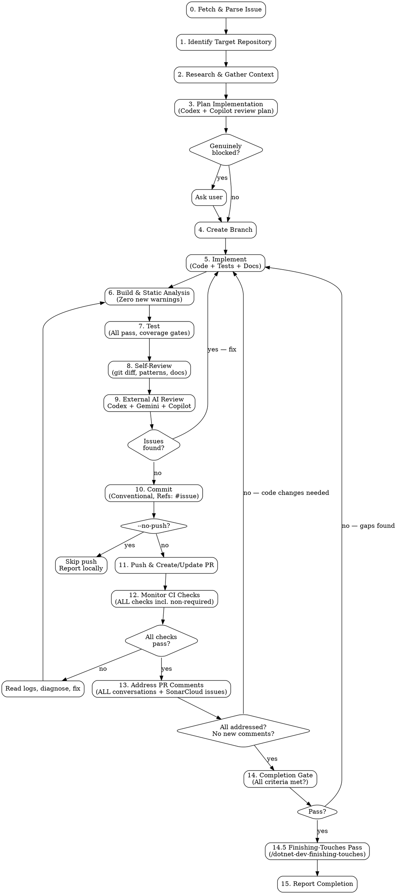

# Implement GitHub Issue

## Overview

Orchestrate autonomous, end-to-end implementation of a GitHub issue — from fetching the issue through research, planning, coding, testing, PR creation, CI monitoring, and PR comment resolution until the PR is clean and complete.

**Core principles:**

- **Maximum autonomy** — research before asking. Only ask the user when genuinely blocked after exhausting all research options.
- **Maximum thoroughness** — every phase has explicit quality gates. No shortcuts. No skipped steps.
- **Evidence before claims** — never report completion without evidence (build output, test counts, CI status, PR URL).
- **All comments addressed** — every single PR comment and conversation must be addressed. No exceptions. Bot-authored threads (CodeRabbit, Codacy, Bito, SonarCloud) follow the same triage rules as human reviewers. SonarCloud / SonarQube Cloud additionally reports issues that exist **only in the SonarCloud platform** (not as GitHub comments) — these are fetched via the `sonarqube-cloud` MCP server and resolved with the same seven-category triage.
- **All checks pass — non-negotiable.** The hard gate for this skill is defined in **`../../../.claude/rules/pr-checks-completion-gate.md`** (workspace-level). The skill reports complete only when **all four** gate conditions are simultaneously true on the latest pushed commit:
  1. Every CI check (build, tests, Analyze, Codacy, SonarCloud / SonarQube, CodeQL, CodeRabbit, Bito, coverage bots, repository-specific checks) shows `pass` — no `fail`, `pending`, `queued`, `in_progress`, `action_required`, or `skipped`. Required vs not-required is irrelevant.
  2. Every static-analysis bot has rendered a verdict and that verdict is "no new issues". A bot that has not yet posted its check is **not** the same as a passing bot — wait for it (use `ScheduleWakeup` ~270s).
  3. Every PR review thread is either resolved or has us as the latest contributor with an active reply.
  4. Re-polling produces no new threads, comments, or check runs.

  **Stale checks are still failures.** "Codacy is stale, expected to go green" is **not** an acceptable completion claim. Wait for the rescan or push a follow-up to retrigger.

**Announce at start:** "I'm using the implement-issue skill to implement GitHub issue #\<number\>."

## Invocation

```
/implement-issue <github-issue-url>                # Full end-to-end
/implement-issue <github-issue-url> --no-push      # Implement + commit locally, skip push/PR/CI
```

Supported URL formats:
- `https://github.com/<owner>/<repo>/issues/<number>`
- `<owner>/<repo>#<number>`
- `#<number>` (current repo)

**`--no-push` flag:** When set, skip all push, PR creation, CI monitoring, and PR comment resolution steps. Commit locally only.

## The Process



---

### Phase 0: Fetch & Parse Issue

1. **Parse the URL** to extract `owner`, `repo`, and `issue-number`.
2. **Fetch the full issue:**
   ```bash
   gh issue view <number> --repo <owner>/<repo> --json number,title,body,labels,assignees,milestone,state,comments,projectItems
   ```
3. **Extract and understand:**
   - **Title** and **description** — what needs to be done.
   - **Acceptance criteria** — look for a section in the body (e.g. "## Acceptance Criteria", "### AC", checkboxes). If none, derive from the description.
   - **Labels** — determine change type (`bug` → fix, `enhancement`/`feature` → feature, `documentation` → docs, etc.).
   - **Linked issues/PRs** — referenced in the body or comments (`#123`, `Depends on ...`).
   - **Comments** — additional context, clarifications, decisions from the discussion.
4. **If the issue is closed** or already has a linked merged PR that fully addresses it, stop and inform the user.

### Phase 1: Identify Target Repository

1. Determine the target repository from the issue URL.
2. Map to the local workspace directory: `C:\DevNet\my\mrploch\<repo-name>\`.
3. Verify the repo is cloned:
   ```bash
   ls "C:/DevNet/my/mrploch/<repo-name>"
   ```
4. Navigate to the repo and ensure it is up to date:
   ```bash
   cd "C:/DevNet/my/mrploch/<repo-name>"
   git fetch origin
   git status
   ```
5. Identify the base branch (`main` or `master`):
   ```bash
   git symbolic-ref refs/remotes/origin/HEAD 2>/dev/null | sed 's@^refs/remotes/origin/@@'
   ```
   If that fails, check `git branch -r` for `origin/main` or `origin/master`. `ploch-common` uses `master`; newer repos use `main`.

### Phase 2: Research & Gather Context

Before writing any code, build comprehensive understanding. This phase is critical — thorough research prevents wasted implementation time.

1. **Read the target repo:**
   - README.md, CLAUDE.md, `.claude/rules/` files.
   - Relevant source files in the area of change.
   - Existing tests for the affected modules.
   - Project structure (`src/`, `tests/`, solution files).
   - `Directory.Build.props`, `Directory.Packages.props` for build configuration.
2. **Check related issues and PRs:**
   ```bash
   # Related issues (open and closed)
   gh issue list --repo <owner>/<repo> --search "<keywords>" --state all --limit 10
   # Related PRs (open and recently closed/merged)
   gh pr list --repo <owner>/<repo> --search "<keywords>" --state all --limit 10
   ```
3. **Read linked or related PRs** for context on prior decisions and approaches:
   ```bash
   gh pr view <pr-number> --repo <owner>/<repo> --json title,body,files,commits
   gh pr diff <pr-number> --repo <owner>/<repo>
   ```
4. **Check sibling repos** for patterns — browse `C:\DevNet\my\mrploch\` siblings:
   - `ploch-common` — extension methods, serialisation, DI bundles, CRUD endpoints.
   - `ploch-data` — repository pattern, Unit of Work, entity configurations, Specification.
   - `ploch-lists`, `ploch-groupmatters` — application-level patterns (API, data layer, model).
   - `mrploch-development` — shared build config, dependency versions.
5. **Research externally** if needed:
   - Microsoft Learn docs: `mcp__claude_ai_Microsoft_Learn__microsoft_docs_search`
   - Library documentation via Context7: `mcp__plugin_context7_context7__resolve-library-id` then `query-docs`
   - External repo understanding via DeepWiki: `mcp__plugin_10x-swe_deepwiki__ask_question`
   - Web search for non-obvious problems or unfamiliar APIs.
6. **Understand the area of change** — read the specific files, classes, and methods that will be affected. Trace call chains. Understand the data flow. Identify what tests exist and what patterns they follow.

### Phase 3: Plan Implementation

1. **Create a detailed plan** using **TodoWrite** with sub-tasks covering:
   - Implementation tasks (code changes, new files, modified files).
   - Test creation (unit tests, integration tests if needed, bug-reproducing test if it's a bug fix).
   - Documentation tasks (XML docs on new public APIs, README/doc page updates).
   - SampleApp updates (if working on `ploch-data` — see `rules/sample-apps.md`).
   - Build verification.
   - Self-review.
   - Commit.
   - Push/PR (unless `--no-push`).

2. **Consult two external models for plan review** — send both requests in the same tool-call block so they run concurrently:
   ```
   mcp__codex-cli__codex                          # OpenAI lens
   copilot -p "<plan brief>" --model grok-4.6 …   # xAI lens, via Bash — see rules/external-ai-review.md
   ```
   Send the plan to each along with:
   - The issue description and acceptance criteria.
   - Key files and patterns discovered during research.
   - Any design decisions you've made and their rationale.

   Ask each to review the plan for completeness, correctness, and adherence to project patterns. A plan is cheap to fix and expensive to get wrong, so it earns two independent opinions before any code is written. Full Copilot flags, preflight and fallbacks: [`rules/external-ai-review.md`](../../rules/external-ai-review.md).

3. **Address the feedback** — adjust the plan if either reviewer identifies gaps, risks, or improvements. Where they disagree, judge on the evidence; if the disagreement is both genuine and load-bearing, surface it to the user rather than picking silently.

4. **Auto-proceed** unless there are genuinely blocking questions that cannot be resolved by research or best judgment. Resolve uncertainties yourself in most cases.

### Phase 4: Create Branch

1. Ensure you are on the base branch and it is up to date:
   ```bash
   git checkout <base-branch> && git pull origin <base-branch>
   ```
2. Determine the change type from the issue analysis (Phase 0). Mapping:
   - `bug` label or bug-related title → `fix`
   - `enhancement`/`feature` label or new capability → `feature`
   - Documentation-only → `docs`
   - Maintenance, config, housekeeping → `chore`
   - Code restructuring without behaviour change → `refactor`
   - Performance improvement → `perf`
   - Tests only → `test`
3. Create the branch following the naming convention (see `rules/branch-naming.md`):
   ```bash
   git checkout -b <change-type>/<issue-number>-<brief-description>
   ```
   Example: `feature/72-dbcontext-creation-lifecycle-plugins`, `fix/187-duplicate-entity-concurrent-upsert`

### Phase 5: Implement

Execute the plan from Phase 3. Follow all project rules.

#### Bug-Fix Protocol (test-first)

When the issue is a bug fix:

1. **Write a failing test first** that reproduces the bug described in the issue.
2. **Run the test** and verify it fails for the correct reason (the bug).
3. **Implement the fix.**
4. **Run the test again** and verify it now passes.
5. This test serves as a regression guard — it must remain in the test suite.

#### Code Implementation

- Follow all project rules: naming (`rules/naming.md`), code quality (`rules/code-quality.md`), domain model (`rules/domain-model.md`), data access (`rules/data-access.md`), project structure (`rules/project-structure.md`).
- Match existing patterns in the codebase — consistency over personal preference.
- For independent sub-tasks within the implementation, consider dispatching parallel agents using `superpowers:dispatching-parallel-agents`.

#### Test Implementation

- **xUnit v3** framework, **FluentAssertions** for assertions, **AutoFixture** for test data generation.
- Test naming: `<TestedMethodName>_should_<what_it_should_do>` (unit), `<Scenario>_should_<what_it_should_do>` (integration).
- Test both positive and negative cases.
- **Test edge conditions** — boundary values, null inputs, empty collections, concurrent access, large inputs where relevant.
- Mock external dependencies for unit tests.
- Aim for **≥80% coverage on new code** (quality gate).
- See `rules/writing-dotnet-tests.md` for full standards.

#### Documentation

- **XML documentation** on all new/modified public types, methods, properties (for public/open-source packages). Follow Microsoft's style. Include `<example>` blocks where usage is not obvious. See `rules/documentation.md`.
- **Update project markdown documentation** — manually-authored `.md` files must stay in sync with the code. Discover all project docs:
  ```bash
  REPO_ROOT=$(git rev-parse --show-toplevel)
  # Primary: docs/ folder, root-level docs, and any other .md files in the project
  find "$REPO_ROOT/docs" -name "*.md" 2>/dev/null
  ls "$REPO_ROOT"/README.md "$REPO_ROOT"/RELEASE_NOTES.md "$REPO_ROOT"/CHANGELOG.md 2>/dev/null
  find "$REPO_ROOT" -maxdepth 2 -name "*.md" -not -path "*/.git/*" -not -path "*/node_modules/*" -not -path "*/bin/*" -not -path "*/obj/*" -not -path "*/.claude/*" -not -path "*/change-log/*" 2>/dev/null
  ```
  For each documentation file found, check whether your changes affect what it describes:
  - **README.md** — features, APIs, usage patterns, installation instructions, quick-start examples, configuration options.
  - **docs/*.md** — design documents, architecture guides, spec files, migration guides, API references.
  - **RELEASE_NOTES.md / CHANGELOG.md** — add entries for user-visible changes (new features, breaking changes, significant bug fixes).
  - If a doc describes something you changed → **update it**. If it contains code examples referencing modified APIs → **update or verify them**. If it describes a removed feature → **remove or update the section**.
  - See `rules/documentation.md` for full standards.

#### SampleApp (ploch-data only)

If working on the `ploch-data` repository and the change adds or modifies library features:
- Update the SampleApp to demonstrate the new/changed features.
- The SampleApp must use NuGet package references, not ProjectReference.
- See `rules/sample-apps.md`.

### Phase 6: Build & Static Analysis

**Why this phase matters:** The static analysers configured in this workspace (StyleCop, Roslynator, SonarAnalyzer, etc.) produce warnings that CI pipelines will surface as PR comments. Fixing them locally is **orders of magnitude faster** than pushing, waiting for pipelines, reading PR comments, fixing, pushing again, and waiting again. Treat this phase as the primary quality gate — the goal is **zero warnings before any push**.

#### Step 1: Build the full solution

```bash
dotnet build <solution-file> -warnaserror-
```

Read the **entire** build output. Do not skim.

#### Step 2: Catalogue every warning

Go through every warning in the build output. These come from:
- **StyleCop.Analyzers** — naming, documentation, layout, ordering.
- **Roslynator.Analyzers** — code simplification, redundancy, best practices.
- **SonarAnalyzer.CSharp** — bugs, code smells, security hotspots.
- **Microsoft.CodeAnalysis.NetAnalyzers** — .NET API usage, globalisation, performance, reliability.
- **codecracker.CSharp** — additional code quality checks.
- **Microsoft.VisualStudio.Threading.Analyzers** — async/await correctness.
- **EnforceCodeStyleInBuild** — `.editorconfig` style enforcement.

#### Step 3: Fix every warning

- Fix **all** warnings, not just those on lines you touched. If the build produces a warning, it must be resolved.
- If a warning is on code you did not modify but is in a file you touched, fix it anyway — leave files cleaner than you found them.
- If a warning is in a file you did not touch at all, fix it if it is trivial (quick naming fix, missing modifier). For complex pre-existing issues outside your scope, open a GitHub issue (label it `important` if it is high-priority).
- **Do not suppress warnings** (`#pragma warning disable`, `[SuppressMessage]`) without a documented, valid justification. Suppression is a last resort, not a shortcut.
- **Do not disable analyser rules** in `.editorconfig` or `GlobalSuppressions.cs` to make the build clean.

#### Step 4: Rebuild and verify clean

```bash
dotnet build <solution-file>
```

The build output must show **zero warnings**. If any remain, go back to Step 3. Do not proceed to Phase 7 until the build is completely clean.

#### Summary

| Gate | Requirement |
|------|-------------|
| Compilation | Zero errors |
| Static analysis warnings | Zero (all fixed) |
| Code style (.editorconfig) | Zero violations |
| Suppressions added | Zero (unless justified and documented) |

### Phase 7: Test

```bash
dotnet test <solution-file>
```

- **All tests must pass** — zero failures, zero skipped (unless pre-existing skips unrelated to your change).
- Verify that new tests actually exercise the new code (not passing trivially).
- Verify test coverage on new code meets the **80% quality gate**.
- **REQUIRED:** Use `superpowers:verification-before-completion` — run the test command, read the full output, confirm pass/fail counts before claiming tests pass.

### Phase 8: Self-Review

Before committing, review your own changes thoroughly:

1. Run `git diff` (or `git diff --staged` if already staged) and **read every changed line**.
2. Check for:
   - Adherence to project patterns and conventions.
   - Unused code, dead imports, unreachable branches.
   - Missing error handling at system boundaries.
   - Naming consistency (British English, camelCase methods, verb-first method names).
   - No PII in test data.
   - No new warnings.
   - XML documentation on all new public APIs (for public libraries).
   - **Project markdown documentation in sync with code changes** — scan `docs/`, `README.md`, `RELEASE_NOTES.md`, and any other `.md` files in the repo for content that references behaviour, APIs, configuration, or features you changed. Update any sections that are now stale. Do not leave docs describing the old behaviour.
   - SampleApp updated if needed (ploch-data).
3. Re-validate against the original issue requirements and acceptance criteria from Phase 0. Did you implement everything that was asked? Did you miss any AC?
4. If anything needs improvement: fix it, then loop back to **Phase 6** (Build).

### Phase 9: External AI Review — Codex + Gemini + Copilot

**Panel definition, invocation flags, preflight and fallbacks: [`rules/external-ai-review.md`](../../rules/external-ai-review.md).**

All three reviews are **mandatory** for every non-trivial change — three providers, three sets of blind spots. Run them in parallel (one tool-call block) and pass **full context** to each: the issue number + title + requirements, the design decisions taken and why, the diff (`git diff <base-branch>...HEAD`), verification evidence (build/test results), and a request for a structured verdict (`APPROVED` / `APPROVED_WITH_NOTES` / `CHANGES_REQUESTED` / `REJECTED` with concrete findings).

1. **Codex review:**
   ```
   mcp__codex-cli__review   (or mcp__codex-cli__codex with a review brief)
   ```
   Provide the diff and full context as above. **Fallback:** if the Codex MCP is unavailable (e.g. account/model restriction — try at least one alternative model before concluding), substitute an independent local review agent (e.g. `feature-dev:code-reviewer`) with the same brief, and record the substitution in the PR description and completion report. Never silently skip the second opinion.
2. **Gemini review:**
   ```
   mcp__gemini__gemini-analyze-code   (or mcp__gemini__gemini-query with the diff inline)
   ```
   Provide the same full-context brief and the diff. Ask specifically for: correctness issues, missed edge cases, API-contract concerns, and test-coverage gaps.
3. **Copilot review:**
   ```bash
   copilot -p "$BRIEF" --model grok-4.6 --effort high --allow-all-tools \
     --deny-tool 'write' --disable-builtin-mcps --no-ask-user -s --log-level none -C "$REPO_ROOT"
   ```
   Shell-out through `Bash` — Copilot is **not** an MCP server, so there is no `mcp__copilot__*` tool to load. Use the full canonical flag set from [`rules/external-ai-review.md`](../../rules/external-ai-review.md) § Copilot CLI Invocation Contract (the abbreviated form above omits the `shell(git …)` / `shell(gh …)` denials). Run the preflight first; on failure follow the fallback ladder (retry with `GITHUB_TOKEN`/`GH_TOKEN`/`COPILOT_GITHUB_TOKEN` stripped → Kimi K3 → ask the user). Afterwards verify `git status --porcelain` is unchanged.
4. **Review all feedback** — evaluate each suggestion from all three reviewers on merit. Deduplicate overlapping findings, crediting each reviewer that raised them; a finding raised independently by two model families is higher-confidence.
5. **Address valid feedback** — if code changes are needed, make them and loop back to **Phase 6** (Build), then re-run the affected reviewer on the revised diff.
6. **Document disagreements** — if you disagree with a suggestion, note your reasoning (in the PR description's Design Decisions section if user-visible). This is acceptable — not every suggestion must be implemented, but a declined finding is recorded with its evidence, never silently dropped.
7. **Record which model each reviewer ran** — Copilot's in particular, so a fallback to Kimi K3 is visible in the completion report.

**Skip this phase** only for truly trivial changes (single-line typo fix, config-only change).

### Phase 10: Commit

- **One commit per logical change** — typically one commit for the entire issue. For large issues with naturally separable parts, use multiple focused commits.
- **Conventional Commits** format (see `rules/commits.md`):
  ```
  <type>(<scope>): <subject>

  <body — what changed and why>

  [BREAKING CHANGE: <description>]
  Refs: #<issue-number>
  ```
- The `Refs: #<issue-number>` footer is **mandatory**. The issue number comes from Phase 0.
- Detect and document breaking changes — check for removed/renamed public APIs, changed signatures, changed defaults. Add `BREAKING CHANGE:` footer if any.
- Stage specific files — **never** `git add -A` or `git add .`.
- **Never amend** existing commits unless the user explicitly asks.
- Update the change log if the commit contains user-visible changes (new features, breaking changes, significant fixes).

### Phase 11: Push & Create PR (skip if `--no-push`)

0. **Pre-push build verification** — before any push, run a final clean build of the full solution and confirm **zero warnings**:
   ```bash
   dotnet build <solution-file>
   ```
   If any warnings appear, **stop and fix them before pushing**. This is critical — every warning you let through will come back as a CI failure or PR comment, costing a full pipeline round-trip. Fix locally first.

1. **Push the branch:**
   ```bash
   git push -u origin HEAD
   ```

2. **Check for existing PR:**
   ```bash
   gh pr view --json number,url 2>/dev/null || echo "NO_PR"
   ```

3. **Read PR template** (if it exists):
   ```bash
   cat .github/pull_request_template.md 2>/dev/null || cat .github/PULL_REQUEST_TEMPLATE.md 2>/dev/null
   ```

4. **Create PR** with a detailed description following `rules/pr-descriptions.md`:
   ```bash
   gh pr create --title "<type>(<scope>): <subject>" --body "$(cat <<'EOF'
   ## Summary

   <What this PR does and why. Reference the issue.>

   ## Changes

   - <Specific change 1>
   - <Specific change 2>
   - ...

   ## Design Decisions

   <Non-obvious choices and their rationale>

   ## Testing

   - Unit tests: <count> added/modified
   - Manual verification: <what was tested>
   - Coverage: ~<percentage>% on new code

   ## Related

   Closes #<issue-number>
   EOF
   )" && gh pr edit --add-assignee @me
   ```

4b. **Request a GitHub Copilot review (mandatory):** immediately after creating the PR, request Copilot as a reviewer via the GitHub MCP tool:
   ```
   mcp__github__request_copilot_review(owner="<owner>", repo="<repo>", pullNumber=<pr-number>)
   ```
   Fallback if the MCP tool is unavailable:
   ```bash
   gh api repos/<owner>/<repo>/pulls/<pr-number>/requested_reviewers -f "reviewers[]=copilot-pull-request-reviewer[bot]"
   ```
   Copilot's review comments are then addressed in Phase 13 like any other reviewer's.

5. **If updating an existing PR** (e.g. after fix loop):
   ```bash
   gh pr edit <pr-number> --body "$(cat <<'EOF'
   [updated body reflecting final state]
   EOF
   )"
   ```

### Phase 12: Monitor CI Checks (skip if `--no-push`)

**Authoritative reference:** `.claude/rules/pr-checks-completion-gate.md` (workspace-level). The four-condition gate defined there is the bar this phase must pass.

**Bots that must reach a `success` verdict before this phase exits** (when present on the PR): `build`, `Test Results`, `Analyze (csharp)` (CodeQL), `Codacy Static Code Analysis`, `SonarCloud Code Analysis` / `SonarQube Cloud`, `CodeRabbit`, `Bito AI Code Review Agent`, any coverage bot (Codecov / Coveralls / Codacy Coverage), and any repository-specific custom check. A bot that has not yet appeared in `gh pr checks` is **not** absent — it is **pending its first run**, and you wait for it. A bot that says `fail` because it hasn't yet rescanned the latest commit is **still failing** by the gate's definition — wait for the rescan or push a no-op-ish commit to retrigger; do not declare completion with a "stale check" caveat.

1. **Wait for ALL checks** to complete — **including non-required checks:**
   ```bash
   gh pr checks <pr-number> --watch
   ```

2. **If any check fails:**
   a. Retrieve the failure logs:
      ```bash
      # Find the failed run
      gh run list --branch <branch-name> --limit 5
      # Get failure details
      gh run view <run-id> --log-failed
      ```
   b. **Diagnose the root cause** — read the actual error output. Do not guess.
   c. If the failure is not obvious, research the error (web search, docs, sibling repos for how they handle it).
   d. Fix the issue in code.
   e. **Loop back to Phase 6** (Build → Test → Self-Review → Commit → Push).
   f. After pushing the fix, monitor checks again. Repeat until **all green**.

3. **Do not:**
   - Ignore or dismiss failing checks — even non-required ones.
   - Assume a failure is flaky without evidence (check if the same test fails consistently).
   - Push speculative fixes without reading the failure logs.
   - Disable a rule, suppress an error, or skip a check to make CI pass.

### Phase 13: Address PR Comments & Reviews (skip if `--no-push`)

**Authoritative reference:** `.claude/rules/pr-checks-completion-gate.md` § "Conversations Must Be Addressed". The seven-category triage and the reply-quality bar defined there are the standard.

After CI checks pass, review **ALL** comments and conversations on the PR. AI code review tools — **CodeRabbit, Codacy, SonarCloud, SonarQube, Bito, codeant-ai, and any other automated reviewer** — will add comments and review threads. Every single one must be addressed using the triage path in the rule:

- `VALID_ISSUE` / `SUGGESTION_ACCEPTED` → fix code → push → wait for CI → reply citing commit hash → resolve thread
- `FALSE_POSITIVE` → reply with **specific evidence** (file:line, test name, spec doc, runtime invariant — not just "the bot is wrong") → resolve thread
- `ALREADY_FIXED` → reply citing the commit hash that fixed it → resolve thread
- `SUGGESTION_DECLINED` → reply with the principled reason → resolve thread
- `QUESTION` → reply with the answer → resolve thread
- `OUT_OF_SCOPE` → open follow-up GitHub issue → reply linking the issue → resolve thread

**A thread is never closed without a reply.** Bot-flagged threads follow the same rules as human-flagged threads.

#### SonarCloud / SonarQube Cloud — platform issues (not just PR comments)

SonarCloud rarely posts one PR thread per finding — it posts a single summary comment plus a `SonarQube Cloud` status check. The individual bugs, code smells, vulnerabilities, and security hotspots live in the SonarCloud platform and **must** be fetched via the `sonarqube-cloud` MCP server (configured at workspace scope — see `mrploch/CLAUDE.md` § "SonarQube MCP Servers"). A passing quality gate does **not** mean zero issues — a gate can pass with new issues below threshold.

1. **Resolve the project key** — `.sonarlint/connectedMode.json` → `projectKey`; else `sonar.projectKey` in `sonar-project.properties` or `.github/workflows/*.yml`; else `mcp__sonarqube-cloud__search_my_sonarqube_projects(q="<repo>")`.
2. **Confirm the PR id** — SonarCloud keys a PR by its GitHub PR number; verify with `mcp__sonarqube-cloud__list_pull_requests(projectKey="<key>")`.
3. **Fetch every open finding for the PR** (page through all results; use `mcp__sonarqube-cloud__show_rule(key="<rule-key>")` for unfamiliar rules):
   - `mcp__sonarqube-cloud__search_sonar_issues_in_projects(projects=["<key>"], pullRequestId="<pr-number>", issueStatuses=["OPEN","CONFIRMED"])`
   - `mcp__sonarqube-cloud__search_security_hotspots(projectKey="<key>", pullRequest="<pr-number>", status=["TO_REVIEW"])`
   - `mcp__sonarqube-cloud__get_project_quality_gate_status(projectKey="<key>", pullRequest="<pr-number>")`
4. **Triage and resolve each finding** with the same seven-category model:
   - `VALID_ISSUE` / `SUGGESTION_ACCEPTED` → fix in code → loop back to **Phase 6** → the next scan auto-marks it `FIXED`.
   - `FALSE_POSITIVE` → `mcp__sonarqube-cloud__change_sonar_issue_status(key="<issue-key>", status=["falsepositive"])` — **pause and confirm with the user first** (silencing a finding has the same bar as adding an exclusion).
   - `SUGGESTION_DECLINED` / won't-fix → `mcp__sonarqube-cloud__change_sonar_issue_status(key="<issue-key>", status=["accept"])` — **pause and confirm first.**
   - Security hotspot, real risk → fix in code, then `mcp__sonarqube-cloud__change_security_hotspot_status(hotspotKey="<key>", status=["REVIEWED"], resolution=["FIXED"], comment="<what changed>")`.
   - Security hotspot, reviewed safe → `mcp__sonarqube-cloud__change_security_hotspot_status(hotspotKey="<key>", status=["REVIEWED"], resolution=["SAFE"], comment="<evidence>")` — **pause and confirm first.**
5. **Replying to SonarCloud's summary PR comment is not enough** — the comment is addressed only when every platform finding behind it is fixed or carries a confirmed status change. If code changes were made, loop back to **Phase 12** and re-fetch.

#### GitHub PR comments, review threads & conversations

1. **Fetch all PR feedback:**
   ```bash
   # Review comments (inline on code)
   gh api repos/<owner>/<repo>/pulls/<pr-number>/comments --paginate
   # Issue-style comments (on the PR conversation)
   gh api repos/<owner>/<repo>/issues/<pr-number>/comments --paginate
   # Reviews (approve, request-changes, comment)
   gh api repos/<owner>/<repo>/pulls/<pr-number>/reviews --paginate
   ```

2. **For each comment or conversation:**
   - If it identifies a **valid issue** → fix the code.
   - If it is a **false positive or irrelevant** → reply with a clear, specific explanation of why you believe so. Do not just say "false positive" — explain the reasoning.
   - If it is a **suggestion worth considering** → evaluate on merit. Implement if it improves the code; explain why not if you disagree.
   - **Every single conversation must have a response.** No comment left unaddressed. It does not matter whether it is blocking the merge or not.

3. **Reply to comments:**
   ```bash
   # Reply to a review comment
   gh api repos/<owner>/<repo>/pulls/<pr-number>/comments/<comment-id>/replies -f body="<your reply>"
   # Reply to an issue comment
   gh api repos/<owner>/<repo>/issues/<pr-number>/comments -f body="<your reply>"
   ```

4. **If code changes were made:**
   - Commit the fixes (new commit, never amend).
   - Push.
   - **Loop back to Phase 12** (monitor CI checks again).
   - After checks pass, re-fetch comments — new automated comments may have been added by the new push.

5. **Only proceed when:**
   - Zero unaddressed conversations remain.
   - No new comments have appeared since your last round of responses.
   - All CI checks are still green after the latest push.

### Phase 14: Completion Gate

**Authoritative gate:** `.claude/rules/pr-checks-completion-gate.md` (workspace-level). **Reproduce the verification sequence ("The Pre-Completion Verification") from that rule and confirm every output before writing a completion report.**

**Forbidden completion framings** (these were historical failure modes):

- ❌ "Done — Codacy is stale, expected to be green on rescan" → **wait for the rescan**
- ❌ "Done — Bito hasn't run yet" → **wait for Bito**
- ❌ "Done — only non-required checks failing" → **non-required checks count**
- ❌ "Done — addressed the most important PR comments" → **all comments must be addressed**
- ❌ "Done with caveat: external bot dependency" → **bots are part of the gate, no caveats**
- ❌ "Done — SonarCloud quality gate passed" → **a passing gate is not zero issues; enumerate platform findings via the `sonarqube-cloud` MCP server**

Before reporting completion, **every single one** of these criteria must be met:

| # | Criterion | How to Verify |
|---|-----------|---------------|
| 1 | **Zero build warnings (entire solution)** | `dotnet build` output — zero warnings from all static analysers |
| 2 | All tests pass | Test output with counts |
| 3 | Test coverage ≥80% on new code | Coverage report or estimate |
| 4 | Code formatted per .editorconfig | `EnforceCodeStyleInBuild` — no style errors |
| 5 | **All CI checks green** (including non-required) — every check listed by `gh pr checks <pr-number>` shows `pass`. Codacy, SonarCloud / SonarQube, CodeQL, CodeRabbit, Bito, coverage bots, and any repository-specific custom check **all** count, regardless of "required" status. Stale or pending checks fail this criterion. | `gh pr checks <pr-number>` — every line ends with `pass`; cross-check with `gh api repos/<owner>/<repo>/commits/<sha>/check-runs` |
| 6 | **All PR comments and conversations addressed** — including bot-authored ones (CodeRabbit, Codacy, Bito, SonarCloud). Every thread is either resolved or has us as the latest contributor with an active reply. | GraphQL `reviewThreads` query: zero `isResolved=false AND isOutdated=false` threads where the latest commenter is not us |
| 7 | No new comments since last check | Re-fetch after waiting; re-poll until two consecutive polls return identical state |
| 8 | All acceptance criteria from the issue met | Re-read issue body, verify each AC |
| 9 | Documentation up to date | XML docs on public APIs; project markdown docs (README.md, docs/*.md, RELEASE_NOTES.md) reviewed and updated to match code changes |
| 10 | SampleApp works (if ploch-data) | Manual test |
| 11 | Conventional commit with `Refs: #issue` | Commit log |
| 12 | PR description documents all changes and decisions | PR body |
| 13 | **SonarCloud platform clean** — zero `OPEN`/`CONFIRMED` issues and zero `TO_REVIEW` hotspots for the PR. A passing `SonarQube Cloud` GitHub check is **not** sufficient — a quality gate can pass with issues below threshold. | `sonarqube-cloud` MCP: `search_sonar_issues_in_projects` + `search_security_hotspots` for the PR both return empty; `get_project_quality_gate_status` is `OK` |

**If any criterion is not met:** go back and fix it. Do not report completion.

**Never report completion until all of the above are satisfied.** This is non-negotiable. If you find yourself wanting to write "done with caveat", re-read the four conditions in `pr-checks-completion-gate.md` — the caveat is an instruction to keep working.

### Phase 14.5: Finishing-Touches Pass (Mandatory)

After the completion gate passes and **before** reporting, run the **`/dotnet-dev-finishing-touches`** skill on the branch (full mode, not `--no-push`, unless this run used `--no-push`).

- This is a standing user requirement — **do not skip it**, even when the branch looks clean. The pass independently re-verifies XML docs, markdown-doc sync, test coverage, build warnings, the grand review, CI checks, and PR threads with its own gates.
- When the implement-issue phases were thorough, the pass typically confirms a clean state without making changes — that confirmation is the point.
- If the pass **does** make changes, its own fix loop applies (build → test → commit → push → CI → comments), and Phase 14 must be re-verified on the new HEAD before proceeding to Phase 15.
- The finishing-touches completion report satisfies this phase; reference it (or summarise it) in the Phase 15 report.

### Phase 15: Report Completion

Provide a summary with evidence:

```markdown
## Implementation Complete: #<issue-number> — <issue-title>

### Changes Made
- `<file>`: <what changed and why>
- ...

### Testing
- Unit tests: <pass-count> passed, <new-count> new
- Integration tests: <pass-count> passed (if applicable)
- Coverage on new code: ~<percentage>%
- Manual verification: <what was tested>

### CI Status
All checks passing: <link to PR checks or output>

### PR Comments
All <count> conversations addressed.

### PR
<PR URL>

### Notes
<Any important context, trade-offs, or follow-up items>
```

---

## The Fix Loop

When CI fails or PR comments require code changes, the fix loop is:

```
Fix code → Phase 6 (Build — zero warnings locally)
         → Phase 7 (Test — all pass)
         → Phase 8 (Self-Review)
         → Phase 10 (Commit — new commit, not amend)
         → Push (only after local build is clean!)
         → Phase 12 (Monitor CI)
         → Phase 13 (Address Comments) → Phase 14 (Gate)
```

**Critical:** Always confirm zero build warnings locally before pushing. Every warning you push will come back as a CI failure or automated PR comment, costing a full pipeline round-trip (typically 5-15 minutes). Fixing locally takes seconds.

Each iteration creates a **new commit**. After all fixes are done, the PR description should be updated to reflect the **final** state of the changes.

---

## Cross-Repository Changes

When an issue requires changes in multiple repositories:

1. **Identify all affected repos** during Phase 2 (Research).
2. **Plan changes across repos** in Phase 3 — note the dependency order.
3. **Implement in dependency order:**
   - Start with the lowest-level repo (e.g. `ploch-common` before `ploch-data` before `ploch-lists`).
   - Create a branch in each affected repo following the same naming convention, using the same issue number.
4. **Test across repos** — build and test each repo, ensuring cross-repo `ProjectReference` paths work locally.
5. **Create PRs in each repo**, linking them in the PR descriptions ("Depends on mrploch/ploch-common#XX").
6. **Monitor CI and address comments in all repos.**
7. **Merge in dependency order** — upstream repos first so downstream repos can switch to the published NuGet packages.

---

## Autonomous Decision-Making

**Research before asking.** The user expects maximum autonomy.

| Situation | Action |
|-----------|--------|
| Unsure about a pattern | Check sibling repos for examples |
| Unsure about a library API | Context7, Microsoft Learn, DeepWiki, web search |
| Unsure about project convention | Read `.claude/rules/`, `.editorconfig`, existing code |
| Unsure about test approach | Check existing test projects for patterns |
| Build warning you don't understand | Research the analyser rule ID, then fix or document |
| CI check failure | Read logs (`gh run view --log-failed`), identify root cause, fix |
| PR comment you disagree with | Reply with clear reasoning, citing evidence |
| Non-obvious implementation choice | Consult Codex (`mcp__codex-cli__codex`) and/or Copilot (`copilot --model grok-4.6`) for a second opinion |
| Multiple valid approaches | Evaluate trade-offs, pick the one most consistent with existing patterns, document the decision in PR description |

**Only ask the user when:**
- A decision has significant business or architectural impact that cannot be inferred from the issue, codebase, or documentation.
- Multiple valid approaches exist AND the choice materially affects the user AND research hasn't provided a clear winner.
- You are truly blocked with no way to research the answer.

**For everything else:** use your best judgment, document reasoning in commit messages and PR descriptions, and capture anything worth tracking as a GitHub issue (label it `important` if it is high-priority).

---

## Non-Blocking Issues

When you encounter something worth tracking that is outside the current issue's scope, **open a GitHub issue** for it — do not accumulate items in a `TODO-important.md` file. Create an issue when you encounter:
- Questions that can be answered later.
- Suggestions for improvements outside the current issue scope.
- Technical debt noticed but outside scope.
- Concerns about the issue requirements.
- Pre-existing issues discovered during implementation.

Guidance:
- Give it a clear conventional-style title (e.g. `chore: ...`, `test: ...`, `refactor: ...`) and a body capturing the context, why it is out of scope, and a suggested resolution.
- Label genuinely high-priority follow-ups (release blockers, correctness or consumer risk) with the `important` label so they stand out. Create the label first if the repo does not have it.
- Cross-reference the originating issue/PR in the new issue body.
- If the follow-up came from a PR review thread, reply on that thread linking the new issue, per the `OUT_OF_SCOPE` triage in `pr-checks-completion-gate.md`.

---

## Red Flags — STOP and Re-evaluate

If you catch yourself about to do any of these, stop and reconsider:

- About to **skip tests** ("just a small change").
- About to **suppress a warning** without documented justification.
- About to **ask the user** something you could research yourself.
- About to **commit without building and testing** first.
- About to **claim completion** without running verification.
- About to **`git add -A`** instead of staging specific files.
- About to **amend a commit** instead of creating a new one.
- About to **report completion with failing CI checks**.
- About to **report completion with unaddressed PR comments**.
- About to **ignore a non-required CI check** failure.
- About to **push without reading the full `git diff`**.
- About to **push with build warnings still present** — fix them locally first.
- About to **disable a rule or analyser** to make the build pass.
- About to **report completion without verifying the SampleApp** (ploch-data).
- About to **leave documentation out of sync** with code changes.
- About to **trust the SonarCloud quality-gate `pass`** as proof of zero issues — query the platform via the `sonarqube-cloud` MCP server instead.
- About to **report completion without sweeping SonarCloud platform issues** (Phase 13).
- About to **report completion without running the `/dotnet-dev-finishing-touches` pass** (Phase 14.5).

---

## Quick Reference

| Phase | Gate | Evidence Required |
|-------|------|-------------------|
| 0. Fetch | Issue parsed | Title, body, labels, ACs extracted |
| 1. Repo | Repo identified and up to date | `git status` clean |
| 2. Research | Context gathered | Key files and patterns identified |
| 3. Plan | Reviewed by Codex + Copilot | Plan approved or adjusted |
| 4. Branch | Created from latest base | Branch name follows convention |
| 5. Implement | Code + tests + docs written | Files created/modified |
| 6. Build | **Zero warnings (entire solution)** | Build output — zero analyser warnings |
| 7. Test | All pass, ≥80% new coverage | Test output with counts |
| 8. Self-Review | No issues found | `git diff` reviewed |
| 9. External AI Review | Codex, Gemini AND Copilot ran; all feedback addressed; working tree unchanged by reviewers | Verdicts + review notes |
| 10. Commit | Conventional format, `Refs` footer | Commit message |
| 11. PR | Detailed description, linked issue | PR URL |
| 12. CI | ALL green (including non-required) | `gh pr checks` output |
| 13. Comments | ALL addressed (GitHub + SonarCloud platform), no new ones | Zero unresolved threads; zero open SonarCloud issues/hotspots |
| 14. Gate | All 13 criteria met | Checklist verified |
| 14.5 Finishing Touches | `/dotnet-dev-finishing-touches` completed its own gate | Finishing-touches report |
| 15. Report | Evidence provided | Summary with links |

---

## Integration

**References these rules (auto-loaded from `.claude/rules/`):**
- `branch-naming.md` — Branch naming convention
- `commits.md` — Conventional Commit format and issue linking
- `writing-dotnet-tests.md` — xUnit v3, FluentAssertions, AutoFixture standards
- `code-quality.md` — Code quality and error handling standards
- `naming.md` — Naming conventions
- `documentation.md` — XML docs and markdown documentation sync
- `pr-descriptions.md` — PR description standards
- `sample-apps.md` — SampleApp rules for ploch-data
- `data-access.md`, `data-project.md`, `data-provider-project.md` — Data layer patterns
- `domain-model.md` — Entity design with Ploch.Data.Model interfaces
- `project-structure.md` — Repository and project layout conventions
- `agent.md` — Agent behaviour specification and CI check gate

**Uses these skills when appropriate:**
- **dotnet-dev-finishing-touches** — REQUIRED final quality pass after the completion gate (Phase 14.5)
- **superpowers:verification-before-completion** — REQUIRED before any completion claim
- **superpowers:dispatching-parallel-agents** — When multiple independent sub-tasks exist
- **superpowers:systematic-debugging** — When encountering failures during implementation
- **commit** — For creating conventional commits (Phase 10)
- **pr** — For creating/updating pull requests (Phase 11)
- **review-pr-comments** — For structured PR comment review (Phase 13)

**Uses these MCP tools:**
- `mcp__codex-cli__codex` — Plan review and ad-hoc consultation for non-obvious decisions
- `mcp__codex-cli__review` — Code change review
- `copilot` CLI on Grok 4.6 — Phase 3 plan review and Phase 9 code review, invoked through `Bash`; flags, preflight and fallbacks in [`rules/external-ai-review.md`](../../rules/external-ai-review.md)
- `mcp__claude_ai_Microsoft_Learn__microsoft_docs_search` / `microsoft_docs_fetch` — .NET documentation
- `mcp__plugin_context7_context7__resolve-library-id` / `query-docs` — Library documentation
- `mcp__plugin_10x-swe_deepwiki__ask_question` — Understanding external repositories
- `mcp__sonarqube-cloud__*` — Fetch and resolve SonarCloud platform issues, security hotspots, and quality-gate status for the PR (Phase 13): `search_my_sonarqube_projects`, `list_pull_requests`, `search_sonar_issues_in_projects`, `search_security_hotspots`, `get_project_quality_gate_status`, `show_rule`, `change_sonar_issue_status`, `change_security_hotspot_status`
- GitHub CLI (`gh`) — Issue fetching, PR management, CI monitoring, comment handling
