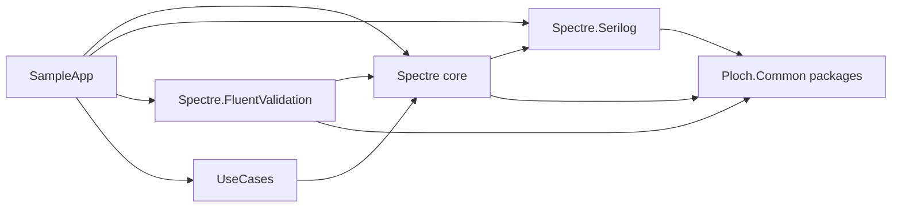

# Architecture — ploch-commandline

| Field | Value |
|---|---|
| Last verified | 2026-10-05, against commit `6a2c931` |
| Verified by | Reading every project file and source file under `src/`; spot checks by `grep` |
| Index | [`CLAUDE.md`](../../CLAUDE.md) |

Paths below are relative to the repository root. `core/` abbreviates
`src/Spectre/CommandLine.Spectre/`.

## 1. Summary

A thin, opinionated façade over the .NET Generic Host and Spectre.Console.Cli. There are no
architectural layers inside the packages; the structure is a builder, two template-method command
base classes, an output pipeline, and dependency-injection modules ("services bundles") from
`Ploch.Common.DependencyInjection`.

The library has no database, no web surface and no user interface beyond the console.

## 2. Component map

| Project | Package | Purpose |
|---|---|---|
| `core/` | `Ploch.CommandLine.Spectre` | `AppBuilder`, command bases, output pipeline, DI bridge |
| `src/Spectre/CommandLine.Spectre.Serilog/` | `Ploch.CommandLine.Spectre.Serilog` | Serilog defaults and bundle |
| `src/Spectre/CommandLine.Spectre.FluentValidation/` | `Ploch.CommandLine.Spectre.FluentValidation` | Settings validator |
| `src/Spectre/CommandLine.UseCases/` | `Ploch.CommandLine.UseCases` | Use-case commands on `Ardalis.Result` |
| `tests/Spectre/*.Tests/` | not packed | One test project per source project |
| `samples/SampleApp/` | not packed | Showcase CLI and its tests; separate solution |

The arrow from core to Serilog is real: `core/Ploch.CommandLine.Spectre.csproj` has a
`ProjectReference` to the Serilog project, so the Serilog package is a mandatory dependency of the
core package, not an optional add-on.

There is **no Autofac package**. A caller who wants another container uses
`ConfigureHost(h => h.UseServiceProviderFactory(...))`.

The main solution `Ploch.CommandLine.Spectre.slnx` holds the four source and four test projects.
The sample has its own `samples/SampleApp/Ploch.CommandLine.Spectre.SampleApp.slnx`.

## 3. Key types

### 3.1 Core — `Ploch.CommandLine.Spectre`

| Type | File | Role |
|---|---|---|
| `AppBuilder` | `core/AppBuilder.cs` | Fluent builder; owns the cancellation source and Ctrl+C handler |
| `ICommandAppExecutor`, `CommandAppExecutor` | `core/CommandAppExecutor.cs` | `Run` / `RunAsync` over Spectre's `CommandApp` |
| `ConsoleAppInfo` | `core/ConsoleAppInfo.cs` | Name, version, description, banner colours |
| `EnvironmentSettings` | `core/EnvironmentSettings.cs` | Static developer-runtime switches from environment variables |
| `DependencyInjectionTypeRegistrar`, `...TypeResolver` | `core/DependencyInjection/` | Bridge from Spectre's registrar to the host's container |
| `AppServicesBundle`, `OutputServicesBundle` | `core/Configuration/` | Default service registrations |

`AppBuilder` members: `Create(args)`, `WithName`, `WithVersion`, `WithDescription`,
`ConfigureServices` (two overloads), `ConfigureAppConfiguration` (two overloads), `ConfigureHost`,
`AddServicesBundle<T>()`, `ConfigureCommandApp(configurator)`, `Dispose()`.

### 3.2 Core — `Ploch.CommandLine.Spectre.Commands`

| Type | Role |
|---|---|
| `AppCommand<TSettings>`, `AsyncAppCommand<TSettings>` | Base classes; implement `DoExecute` / `DoExecuteAsync` |
| `ExitCode` | `Success` 0, `Error` 1, `InvalidInput` 2, `Cancelled` 130 |
| `IExceptionHandler`, `DefaultExceptionHandler` | Turns an exception into output and an exit code |
| `ICommandSettingsValidator<T>`, `CommandSettingsValidator<T>` | Validation hook; default delegates to `settings.Validate()` |
| `ICommandSettingsProcessor`, `CommandArgumentsRootProcessor` | Settings post-processing pipeline |
| `TokensArgumentsProcessor`, `[SupportsTokens]` | Replaces `{date}` and `{datetime}` in marked string properties |

### 3.3 Core — `Ploch.CommandLine.Spectre.Output`

| Type | Role |
|---|---|
| `IOutput`, `AnsiConsoleMarkupOutput` | Fluent console output used by commands |
| `IMessageFormatterProcessor`, `MessageFormatterProcessor` | Picks a writer or formatter by message type |
| `IMessageWriter<T>`, `IMessageFormatter<T>` and the `TypeMessage*` bases | Extension points for custom types |
| `ServiceCollectionOutputExtensions` | `AddMessageFormatter` / `AddMessageWriter` registration helpers |

### 3.4 Other packages

| Package | Types |
|---|---|
| Serilog | `LoggerConfigurationExtensions.ConfigureSerilog`, `SerilogConfigurationBundle`, `SerilogLoggingConfigurator.AddSerilog` |
| FluentValidation | `CommandLineFluentValidationServicesBundle`, `AddCommandLineSettingsFluentValidation`, `FluentCommandSettingsValidator<T>` |
| UseCases | `IUseCase<TRequest,TResponse>`, `IResultUseCase<TRequest,TResponse>`, `UseCaseAsyncCommand<...>` |

## 4. Key flows

### 4.1 Start-up

1. `AppBuilder.Create(args)` creates a `CancellationTokenSource` and subscribes a handler to
   `Console.CancelKeyPress` (`core/AppBuilder.cs`, `Create`).
2. Fluent calls are recorded, not applied. `ConfigureServices`, `ConfigureAppConfiguration` and
   `ConfigureHost` all append to one list, `_hostBuilderOperations`.
3. `ConfigureCommandApp(configurator)`:
   1. validates the application info (a missing name throws) and prints the banner;
   2. calls `Host.CreateDefaultBuilder(args)`;
   3. adds the services bundles as the first services delegate;
   4. replays the recorded operations in call order;
   5. registers the builder's own `CancellationTokenSource` last;
   6. wraps the host builder in `DependencyInjectionTypeRegistrar` and creates `CommandApp`;
   7. returns a `CommandAppExecutor` holding the builder's cancellation token.
4. `executor.Run(args)` hands over to Spectre, which registers its own types, builds the host
   through the registrar, resolves the command, runs it and disposes the resolver.

`args` is passed twice on purpose: to `Create` for host configuration and to `Run` for parsing.
The canonical call site is `samples/SampleApp/src/SampleApp/Program.cs`.

### 4.2 Command execution

1. Spectre binds the settings and calls the command's `Validate` override, which delegates to the
   injected `ICommandSettingsValidator<TSettings>`.
2. `Execute` / `ExecuteAsync` (`core/Commands/AppCommand.cs`, `AsyncAppCommand.cs`) then, inside
   one `try`:
   1. writes an "Executing command" banner and "Processing arguments...";
   2. runs `CommandArgumentsRootProcessor.ProcessArguments(settings)`;
   3. calls `DoExecute` / `DoExecuteAsync` and casts the returned `ExitCode` to `int`.
3. `OperationCanceledException` returns 130. Any other exception goes to `IExceptionHandler`.

The synchronous and asynchronous bases behave identically apart from `await`.

### 4.3 How the other packages plug in

| Package | Mechanism |
|---|---|
| Serilog | Always registered: `AppServicesBundle` declares `SerilogConfigurationBundle` as a dependency. Call `services.AddSerilog(configuration, logName:, logPath:)` to customise |
| FluentValidation | `services.AddCommandLineSettingsFluentValidation(b => b.AddAssembly(...))` registers an open-generic `ICommandSettingsValidator<>` after the default one, so it wins |
| UseCases | Derive from `UseCaseAsyncCommand<...>`, implement `CreateRequest`, register the use case in DI |

## 5. Design rules and invariants

**Call order.** Of two registrations of the same kind, the later call wins, whichever fluent
method made it. The host builder still runs its phases in a fixed order: host configuration,
application configuration, services, container. The full statement is in the XML documentation of
`AppBuilder.ConfigureCommandApp`.

**Configuration precedence**, lowest to highest: `appsettings.json`,
`appsettings.{Environment}.json`, user secrets (Development only), environment variables, command
line, then any source the caller adds through `ConfigureAppConfiguration`. The builder adds nothing
beyond `Host.CreateDefaultBuilder`; re-adding `appsettings.json` would put it above the command
line.

**Cancellation.** The first Ctrl+C cancels cooperatively and prints a message; the second takes
the default path and terminates the process. Commands receive the builder's own token, not one
resolved from the container, and no `ConfigureServices` call can replace the registered source.

**Ownership.** A builder made with `Create` owns its cancellation source and handler and releases
them in `Dispose`. A builder made with the public constructor owns neither.

**Exit codes.** `ExitCode` covers what a command returns. Spectre returns `-1` for parse and
validation failures before a command runs.

**Output and markup.** `FormattableString` messages have their holes escaped. Plain `string`
messages are parsed as markup. `WriteBold` and `WriteError` escape content before wrapping it.
Handler selection is "most derived type wins; first registration wins ties".

**Service lifetimes.** The registrar registers everything Spectre asks for as a singleton, so
commands and settings are singletons resolved from the root provider.

## 6. Extension points

| To change | Do this |
|---|---|
| Services | `ConfigureServices`, or a bundle through `AddServicesBundle<T>()` |
| Configuration sources | `ConfigureAppConfiguration` |
| Anything on the host | `ConfigureHost` |
| Validation | Register an `ICommandSettingsValidator<>`, or use the FluentValidation package |
| Settings post-processing | Register another `ICommandSettingsProcessor` |
| Exception handling | Register an `IExceptionHandler` |
| Output for a type | `AddMessageWriter` / `AddMessageFormatter` |

## 7. Known gaps and sharp edges

Found during the 2026-10-05 review. None is tracked as its own issue yet; see
[`BACKLOG.md`](BACKLOG.md) section 6.

| Area | Finding |
|---|---|
| Dependencies | Core depends on the Serilog package, so logging to files is on for every consumer |
| Hosting | The host is built but never started; hosted services do not run |
| Lifetimes | Singleton commands capture transient services, including `TokensArgumentsProcessor` |
| Cancellation | `catch (OperationCanceledException)` does not check that the token was cancelled |
| Output | `IOutput.Write(string)` throws on user data containing `[` |
| Output | `StringMessageWriter` and `FormattableStringMessageWriter` are unreachable through `IOutput` |
| Banner | The FIGlet banner and "Executing command" lines are always written to standard output |
| Public API | `CommandAttribute`, `CommandInfo`, `CommandInfoFactory`, `CommandAppConfigurator` have no caller in `src/` |
| Guards | `ConfigureCommandApp`, `EnvironmentSettings.Initialize` and the public constructor do not null-check |
| Reuse | `UNVERIFIED`: a second `Run` on one executor probably fails, because it builds the host again |
| Docs | Several snippets disagree with the API; tracked as PLO-620 |

## 8. Where to look

| Question | Start here |
|---|---|
| How is an application assembled? | `core/AppBuilder.cs`, `samples/SampleApp/src/SampleApp/Program.cs` |
| What is registered by default? | `core/Configuration/AppServicesBundle.cs`, `OutputServicesBundle.cs` |
| How does a command run? | `core/Commands/AppCommand.cs` |
| How is output dispatched? | `core/Output/AnsiConsoleMarkupOutput.cs`, `MessageFormatterProcessor.cs` |
| What are the Serilog defaults? | `src/Spectre/CommandLine.Spectre.Serilog/LoggerConfigurationExtensions.cs` |
| What does ordering guarantee? | `tests/Spectre/CommandLine.Spectre.Tests/AppBuilderTests.cs` |
| How do I test a command? | `samples/SampleApp/tests/SampleApp.Tests/Commands/` |
